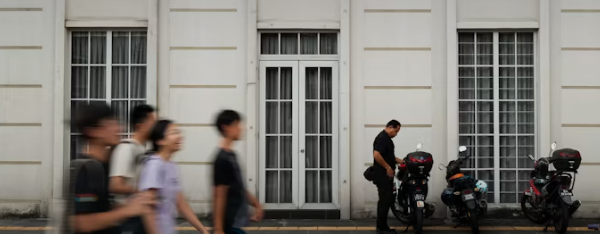
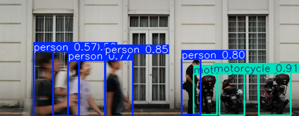
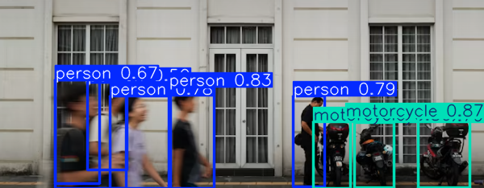

# Object Detection & Annotation from Images and Video using YOLO 

---

## Business Problem

The company needs to collect data from their factory at certain times (start of day, break time, and end of day). This data is collected via CCTV, using video recordings and still images to save storage. The company wants to understand worker behavior on the factory floor specifically, how many workers and vehicles (e.g. motorcycles) are present or passing through the entry area at these times, to spot attendance patterns, entry-point congestion, and unusual activity (e.g. lower-than-expected worker counts during break time).

---

## Objective

- Build a program to detect and count people and vehicles (e.g. motorcycles) in both images and video.
- Compare different YOLO versions and identify the best-performing one for this use case.
- Share the findings in the report below.

---

## Dataset

The dataset consists of two types:

- Image
 |
- Video
 |

### Dataset Characteristics

- 1 image
- 1 video

> **Note:** this is a very small sample (n=1 for each type), used here as an initial proof-of-concept run rather than a statistically robust benchmark. Results and comparisons below should be read as observations from a single case, not generalizable performance numbers. A larger, labeled dataset is needed before drawing firm conclusions — see Limitations.

---

## Exploratory Data Analysis (EDA)

### Key Insights

- The video quality is low; if the model performs well here, it should perform even better on higher-quality video.
- No training from scratch this project uses pretrained YOLO weights only, since one objective is to compare out-of-the-box performance across YOLO versions.
- Results are compared based on the confidence scores the model assigns to each detection (see Model Evaluation for why this is not the same as accuracy).

---

## Preprocessing

- Set a confidence threshold to avoid false positives, while keeping it low enough to still catch lower-confidence detections.
- Keep dataset and output paths in the same folder to simplify path management.
- Add error handling (missing files, unreadable images, failed model loads) for easier debugging.

---

## Modeling

### Architecture Used

Three YOLO versions were compared: **YOLOv8n**, **YOLOv11n**, and **YOLOv26n**. All three used their default COCO-pretrained nano-sized weights no fine-tuning or training was performed.

---

## Model Evaluation

**Important clarification on the metric used:** there is no ground-truth (manually labeled) annotation for this dataset, so true accuracy or precision cannot be computed. What is reported below is the **model's own confidence score** per detection — a measure of how certain the model is about a prediction, not a measure of whether that prediction is actually correct. High confidence does not guarantee a correct detection. Proper accuracy/precision evaluation would require a labeled validation set (see Limitations).

---

## Model Result

### Model Comparison (Image, all 3 versions)

| Rank | Model | Objects Detected | Avg. Confidence | Min Confidence | Max Confidence |
|:---:|:---|---:|---:|---:|---:|
|   1 | YOLOv8n | **8** | **75.53%** | **49.88%** | **90.75%** |
|   2 | YOLOv11n | **9** | 70.94% | 45.83% | 86.55% |
|   3 | YOLOv26n | **8** | 65.12% | 36.44% | 86.84% |

### Detection Results

Comparison on the image dataset:

| Model | Visualization |
|:---|:---|
| YOLOv8n |  |
| YOLOv11n |  |
| YOLOv26n |  |

Video (tested with YOLOv8n only — video comparison across versions is a future step, not yet done):

[Watch YOLOv8n video output](output/video_input.avi)

---

## Key Findings

- A newer YOLO version isn't automatically better for every use case in this single-image test, YOLOv8n produced the highest average confidence.
- YOLOv11n detected the most objects (9), so if recall (catching more potential objects) matters more than raw confidence, it may be preferable.
- YOLOv26n scored lowest here, but this is based on one image only; it likely trades some raw confidence for other gains (e.g. inference speed, edge-device efficiency) that this test doesn't measure. Needs validation on a larger dataset before drawing conclusions.
- On the video, YOLOv8n detections stayed above roughly 50% confidence throughout, but since only one model was tested on video and there's no ground truth, this should be read as "consistently confident," not "100% accurate."

---

## Business Insight

- For an initial deployment, YOLOv8n is the reasonable default based on this test, given its highest average and max confidence scores for both `person` and `motorcycle` classes the two classes most relevant to counting workers and vehicles.
- Confidence scores here were achieved on visibly low-quality video/image input, so counting accuracy should improve further with better camera resolution — though this needs to be verified rather than assumed.
- Since the goal is counting (people/vehicles present at a given time), consistent, correct classification matters more than fine-grained localization — this makes the current pretrained-only approach well-suited to the reframed objective, without needing custom training.

---

## Final Decision

### Recommended Architecture: YOLOv8n (for this proof-of-concept stage)

### Reasons

- Highest average and maximum confidence scores across the tested models in this single-case comparison.
- Detections remained above the ~50% confidence threshold consistently in the video test.
- Results should be re-validated on a larger, labeled dataset before this becomes a production recommendation.

---

## Limitations

- **Sample size:** only 1 image and 1 video were used. This is a proof-of-concept run, not a statistically valid benchmark, results may not generalize.
- **No ground truth:** without labeled data, only confidence scores could be reported, not true accuracy or precision.
- **Video only tested on one model (YOLOv8n):** no cross-version comparison was done for video.
- **No deduplication/tracking:** counts are per-frame/per-image only; the same person or motorcycle could be counted multiple times across frames in a video without object tracking.
- **Dataset quality:** especially the video, was visibly low resolution, which likely constrains detection confidence.
- **No custom training:** all models used pretrained COCO weights only.
- **Not yet tested on real-time/live data.**

---

## Future Improvements

- Collect a larger, labeled dataset (multiple images/videos with ground-truth annotations) to properly measure accuracy and precision, not just confidence.
- Add object tracking (e.g. ByteTrack/DeepSORT via Ultralytics' built-in tracking mode) so people/vehicles are counted once per entry, not once per frame.
- Improve source video/image quality.
- Re-run the YOLO version comparison on video, not just images.
- Test with real-time camera input at the actual entry point(s).
- As a separate, later-stage effort: explore a fine-tuned model with a weapon class for security monitoring — kept out of this version's scope since it needs its own labeled dataset and training pipeline.

---

## Tech Stack

- opencv_python==4.13.0.92
- ultralytics==8.4.115

---

## What I Learned (1% Improvement)

- Learned how YOLO works, and that a newer version isn't always better for a given use case.
- Confidence score and accuracy are not the same thing — accuracy requires ground truth to measure.
- Threshold tuning is crucial and needs a sweet spot for every project.
- YOLO has a lot of potential to explore across many applications.
- Most of the process is wrapped in reusable functions for cleaner, more maintainable code.