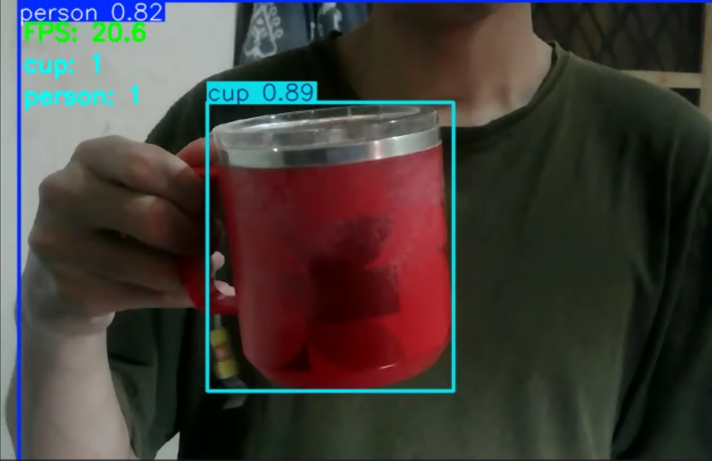

# Real-Time Object Detection Using YOLO

---

## Business Problem

Our client, a cup manufacturing company, struggles with accurately counting products on the production line. Manual counting can occasionally lead to human error. The company wants an automated counting system to help verify product quantities more efficiently.

---

## Objective

- Build a program to detect and count objects automatically.
- Apply the system to a real-time camera feed.
- Share the findings in the report below.

---

## Dataset

The dataset is collected in real time from a camera feed.

### Dataset Characteristics

The data can be collected from various camera sources depending on the company's requirements, including:

- Machine-mounted cameras
- Robotic cameras
- CCTV cameras

The current experiment uses a real-time camera feed as a proof of concept.

---

## Exploratory Data Analysis (EDA)

### Key Insights

- The model can detect objects from a relatively low-quality camera feed, although confidence varies depending on the object and viewing conditions.
- No training from scratch was performed. This project uses pretrained YOLO weights because the target objects are already available in the pretrained model's supported classes.
- Detection confidence can vary depending on object position, viewing angle, lighting, and image quality.

---

## Preprocessing

- Set a confidence threshold to reduce false positives while keeping it low enough to detect valid lower-confidence objects.
- Keep dataset and output paths in the same folder to simplify path management.
- Add error handling for cases where the camera or video source cannot be opened.
- Configure the program to continuously process the camera feed until manually stopped.
- Implement object-counting logic within the detection process.

---

## Modeling

### Architecture Used

YOLOv8n was selected as the primary architecture based on the results of the previous YOLO version comparison.

The previous experiment compared YOLOv8n, YOLOv11n, and YOLOv26n, with YOLOv8n achieving the strongest overall result in that experiment.

The current project uses pretrained YOLOv8n weights without additional training or fine-tuning.

---

## Model Evaluation

The evaluation is based on the **model's own confidence score** for each detection. This score represents how confident the model is about a prediction, not whether the prediction is actually correct.

Since the current camera data is unlabeled, standard object detection metrics such as precision, recall, and mAP cannot be calculated reliably.

---

## Model Result

| Objects Detected | Avg. Confidence of Person | Avg. Confidence of Cup |
|---:|---:|---:|
| 2 | 82% | **89%** |

Real-time video result:

<video src="output/output.mp4" controls width="800"></video>

Screenshot of the result:

---

## Key Findings

- The model achieved an average confidence of **89% for cup detection** in the tested camera feed.
- YOLOv8n was able to detect objects even with the relatively low-quality camera used in this experiment.
- Detection confidence varied depending on the object's position and viewing angle.
- Objects that were more clearly visible to the camera generally produced more stable confidence scores.
- The object-counting logic successfully displayed detected object counts during the real-time test.

---

## Business Insight

- This system has potential to be applied to a production line to automate product counting and reduce manual counting errors.
- The system could potentially be integrated with other production components to compare detected quantities with expected production quantities.
- The confidence scores achieved in this low-quality camera test indicate that the model can serve as a useful proof of concept, although performance under actual factory conditions still needs to be validated.
- The object counter worked correctly during the experiment, but manual verification is still recommended during the initial implementation.

---

## Final Decision

### Recommended Architecture: YOLOv8n

### Reasons

- Achieved strong confidence scores in the tested scenario.
- Successfully detected objects using a relatively low-quality camera feed.
- Was previously selected as the best-performing model in the YOLO version comparison experiment.
- Provides a practical starting point for a real-time production-line counting system.

---

## Limitations

- Since the dataset is unlabeled, standard metrics such as precision, recall, and mAP could not be used to evaluate detection accuracy.
- The system has not been tested with high-speed object movement.
- The system has not been tested under actual factory conditions.
- Different lighting conditions, camera angles, and object distances have not been systematically evaluated.
- The current counting system has not been validated against manually verified ground-truth counts.
- The model has not been fine-tuned using factory-specific data.

---

## Future Improvements

- Collect and label a factory-specific dataset if more rigorous evaluation is required.
- Evaluate the model using precision, recall, mAP, and counting accuracy once labeled data is available.
- Test the system with high-speed object movement.
- Test the system under actual factory conditions.
- Add object tracking to prevent the same object from being counted multiple times across consecutive frames.
- Fine-tune YOLO using factory-specific data if the pretrained model is not sufficiently reliable.

---

## Tech Stack

- opencv-python==4.13.0.92
- ultralytics==8.4.115

---

## What I Learned (1% Improvement)

- Learned how YOLO can be applied to real-time object detection.
- Learned how object detection can be extended into an automatic object-counting system.
- Learned that object position and viewing angle can affect detection confidence.
