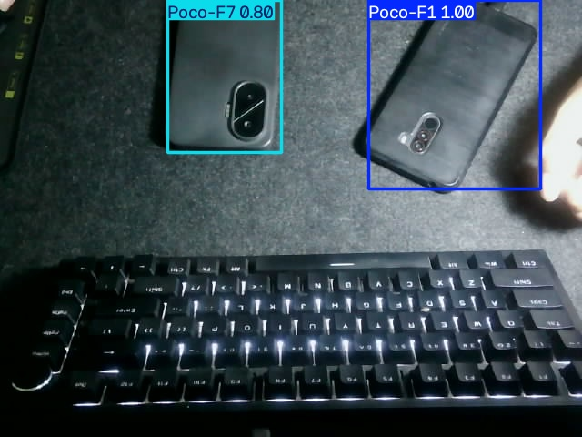

# Real-Time Custom Object Detection Using YOLO and Roboflow

---

## Business Problem

Our client wants to automate product separation on the production line to reduce manual processing time and improve production efficiency.

---

## Objective

- Build a program to detect and distinguish multiple product types.
- Label product images and prepare a custom dataset for model training.
- Train and evaluate a custom YOLO object detection model.
- Deploy the trained model for real-time object detection.

---

## Dataset

The dataset was collected from a real-time camera feed and combined with pretrained YOLO knowledge from the COCO dataset.

### Dataset Characteristics

The data can be collected from various camera sources depending on the company's requirements, including:

- Machine-mounted cameras
- Robotic cameras
- CCTV cameras

For this experiment, a small custom dataset containing **33 images across two product classes** was collected and labeled for training.

---

## Exploratory Data Analysis (EDA)

### Key Insights

- The custom training dataset is relatively small, containing only **33 images across two classes**.
- No model was trained completely from scratch. YOLOv8n was initialized using pretrained weights and then trained on the custom dataset.
- Data augmentation was applied to increase training data diversity and improve the model's ability to generalize.
- Because the training and test images were collected using a similar camera, phone, and background, the evaluation environment may be easier than a real production environment.

---

## Preprocessing

- Labeled the custom dataset using **Roboflow**.
- Applied data augmentation techniques such as rotation, brightness adjustment, blur, and other transformations to increase dataset diversity.
- Resized images to a consistent input size while using padding to preserve the original image aspect ratio.
- Separated the training process from the inference process so the trained model can be reused without retraining.
- Prepared the trained model for real-time object detection.

---

## Modeling

### Architecture Used

- **YOLOv8n** was selected as the primary architecture based on the results of the previous YOLO version comparison.
- **Roboflow** was used for image annotation and dataset preparation because it provides a practical workflow for labeling and preparing custom object detection datasets.
- The pretrained YOLOv8n model was fine-tuned using the custom dataset containing two product classes.

---

## Model Evaluation

Unlike the previous YOLO experiments, this project uses a labeled dataset, allowing standard object detection metrics to be evaluated.

The evaluation metrics include:

- Precision
- Recall
- mAP50
- mAP50-95

---

## Model Result

| Class | Precision | Recall | mAP50 | mAP50-95 |
| :--- | ---: | ---: | ---: | ---: |
| All | **100%** | 79.0% | **94.1%** | **75.4%** |
| Poco-F1 | **100%** | 63.3% | 88.8% | 62.4% |
| Poco-F7 | **100%** | **94.7%** | **99.5%** | **88.5%** |

The model achieved **100% precision overall**, meaning the detected objects in the evaluation set were highly reliable. However, the overall recall was **79%**, indicating that some objects were still missed by the model.

The model performed better on **Poco-F7** than **Poco-F1**, with a recall of 94.7% and mAP50 of 99.5%. This difference may be influenced by the visual similarity between the products and the background conditions in the Poco-F1 images.

### Real-Time Video Result

[YOLOv8n video output](assets/output.gif)

### Screenshot of the Result

---

## Key Findings

- The model achieved strong overall performance despite being trained on a relatively small dataset.
- The model achieved **100% precision**, but the **79% recall** indicates that some objects were still missed.
- Poco-F7 achieved better detection performance than Poco-F1, with **99.5% mAP50** compared with **88.8% mAP50** for Poco-F1.
- The high performance may partly be influenced by the similarity between the training and evaluation environments, since the same phone, camera setup, and background conditions were used.
- Small visual differences between Poco-F1 and Poco-F7 can sometimes cause the model to predict the wrong class, particularly when the camera angle changes.
- Changing the object's position and viewing angle can affect detection confidence and classification performance.

---

## Business Insight

- The model demonstrates potential for automatically distinguishing Poco-F1 and Poco-F7 products on a production line.
- However, the training dataset should be expanded with more diverse images before applying the system to a real production environment.
- The system could potentially be integrated with production machinery to automatically separate products based on the detected class.
- A larger and more diverse dataset would help the model generalize better to different camera angles, backgrounds, lighting conditions, and production environments.

---

## Final Decision

### Recommended Architecture: YOLOv8n

### Reasons

- Achieved **100% overall precision**.
- Achieved **94.1% mAP50** and **75.4% mAP50-95**.
- Successfully detected the target products using a real-time camera feed.
- Demonstrated potential for integration into an automated production process.

The model is suitable as a **proof of concept**, but additional validation is required before production deployment.

---

## Limitations

- The custom dataset is relatively small, containing only **33 images across two classes**.
- The training and evaluation environments were relatively similar, which may make the test scenario easier than real-world production conditions.
- Some Poco-F1 objects were incorrectly classified, particularly when the camera angle or object position changed.
- The system has not yet been integrated with production machinery.
- The model has not been extensively tested under different lighting conditions, backgrounds, camera angles, or object distances.
- The current experiment does not provide enough evidence to confirm production-level reliability.

---

## Future Improvements

- Add more diverse training images to improve generalization and reduce dataset bias.
- Collect images from different backgrounds, angles, lighting conditions, distances, and camera positions.
- Increase the number of training examples for both Poco-F1 and Poco-F7.
- Test the system under actual factory conditions.
- Add object tracking to prevent the same object from being detected multiple times across consecutive frames.
- Fine-tune the confidence threshold and other model parameters to find the optimal operating point for the production environment.
- Integrate the detection system with production machinery for automatic product separation.

---

## Tech Stack

- opencv-python==5.0.0.93
- roboflow==1.4.1
- torch==2.6.0+cu124
- ultralytics==8.4.115

---

## What I Learned (1% Improvement)

- Learned how to label and prepare a custom object detection dataset using Roboflow.
- Learned how dataset diversity, background, and camera angle can affect model performance.
- Learned to evaluate object detection models using precision, recall, mAP50, and mAP50-95 instead of relying only on confidence scores.
- Learned that strong evaluation results do not necessarily guarantee good real-world generalization when the dataset is small or too similar to the evaluation environment.
- Learned how a trained YOLO model can be integrated into a real-time computer vision application.