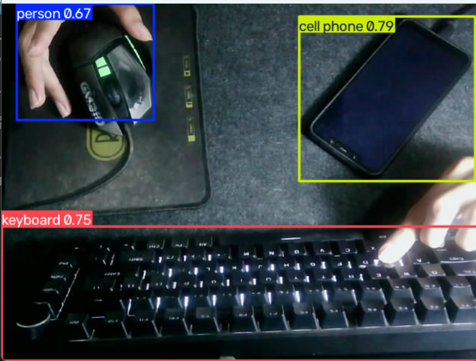
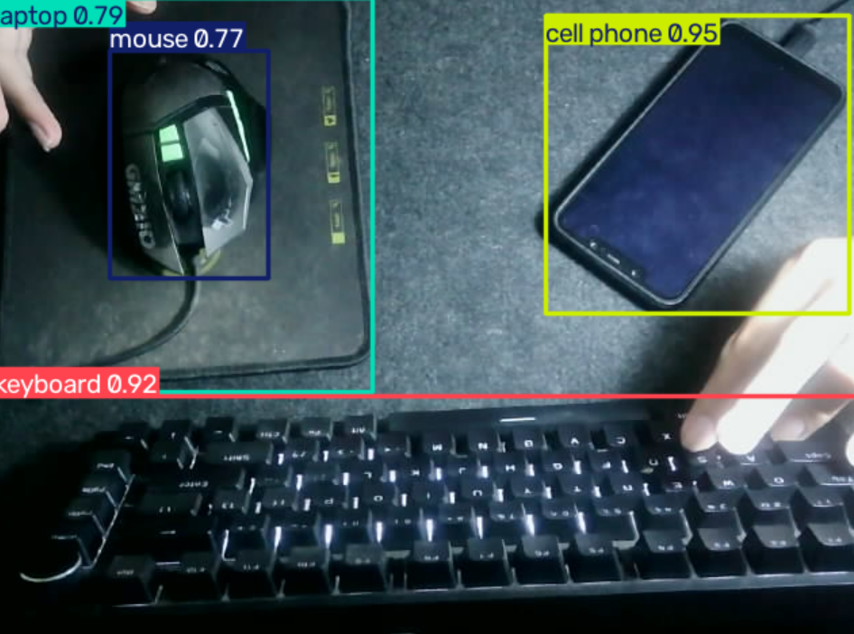

# YOLO vs RT-DETR: Preliminary Object Detection Comparison

> **Note on scope:** This project is a qualitative, confidence-based comparison rather than a rigorous accuracy benchmark. No ground-truth annotations were used, and inference speed was not formally measured. Therefore, the results should be interpreted as an initial comparison, not a definitive model benchmark.

---

## Business Problem

The client wants to evaluate different object detection architectures and determine which approach is more suitable for their production or monitoring environment.

This project compares **YOLOv8n** and **RT-DETR** using the same input conditions to observe differences in object detection behavior and model confidence.

---

## Objective

- Build a program that performs real-time object detection using two different architectures.
- Compare YOLOv8n and RT-DETR using the same input source and environment.
- Analyze differences in detected objects, predicted classes, and confidence scores.
- Provide a preliminary recommendation for further evaluation and potential deployment.

---

## Dataset

Detection was performed using a real-time camera feed.

Both models used **pretrained weights based on the COCO dataset**. No custom dataset, training, or fine-tuning was performed in this experiment.

### Dataset Characteristics

Camera sources considered for potential deployment include:

- Machine-mounted cameras
- Robotic cameras
- CCTV cameras

The current experiment uses a single camera setup as a proof of concept.

---

## Exploratory Data Analysis (EDA)

### Key Insights

- YOLO and RT-DETR represent different approaches to object detection.
- YOLO uses a detection pipeline that traditionally applies Non-Maximum Suppression (NMS) during post-processing.
- RT-DETR uses an end-to-end detection design that does not require traditional NMS post-processing.
- Both models were tested using the same input scene and camera conditions to make the comparison as consistent as possible.
- This experiment focuses on observed detection behavior and confidence scores rather than formal accuracy or computational benchmarking.

---

## Preprocessing

- Used the same input scene and camera setup for both models.
- Maintained similar lighting, object position, and camera angle during testing.
- Applied confidence thresholds to control which detections were displayed.
- Used the same input source when comparing both architectures.
- No custom training or fine-tuning was performed.

---

## Modeling

### Architecture Used

Two object detection architectures were compared:

- **YOLOv8n**, selected based on the results of a previous YOLO version comparison.
- **RT-DETR**, an end-to-end real-time object detection architecture based on the DETR family.

Both models used pretrained weights and were evaluated without additional training.

---

## Evaluation Methodology

No manual ground-truth annotations were available for this experiment. Therefore, standard object detection metrics such as **precision, recall, mAP50, and mAP50-95** could not be calculated.

Instead, the comparison focused on:

- Objects detected
- Predicted class labels
- Model confidence scores
- Qualitative detection behavior

> **Important:** Confidence score represents how confident the model is about its prediction. It does **not** represent detection accuracy. A model can produce a high-confidence prediction that is still incorrect.

In addition, **FPS and inference latency were not formally measured** in this experiment. Therefore, no conclusion about which architecture is computationally faster is made.

---

## Model Result

| Object Detected | YOLOv8n | RT-DETR |
| :--- | ---: | ---: |
| Person | 79% | 67% |
| Phone | 95% | 79% |
| Keyboard | 92% | 75% |
| Mouse | 77% | — |
| Laptop | 79% | — |

### Observed Detection Behavior

- YOLOv8n produced higher confidence scores for all objects that were detected by both models.
- YOLOv8n detected the mouse as a mouse.
- RT-DETR did not classify the mouse as a mouse, but instead produced a laptop prediction for an object in that area.
- This demonstrates that detecting an additional object does not necessarily mean that the detection is more accurate.

### Screenshot of the Result (YOLOv8n)

### Screenshot of the Result (RT-DETR)

---

## Key Findings

- **YOLOv8n produced higher observed confidence scores for the objects detected by both models** in this test case.
- YOLOv8n successfully detected the mouse, while RT-DETR produced a different prediction for the same area.
- RT-DETR detected an additional object but incorrectly classified it as a laptop.
- A high confidence score does not guarantee a correct prediction, as demonstrated by the RT-DETR misclassification.
- Lowering the YOLOv8n confidence threshold to approximately 30% did not result in a mouse detection, even after changing the object position and camera angle.
- This suggests that the mouse detection issue may be related to the pretrained model's class recognition rather than simply the confidence threshold.
- Object position, camera angle, lighting, and background can affect detection behavior and confidence.

---

## Business Insight

- Based on the observed results, **YOLOv8n is the more promising candidate for the current proof-of-concept use case**.
- YOLOv8n produced higher confidence for the shared detected objects and successfully identified the mouse in this test.
- However, this result does not prove that YOLOv8n is universally more accurate than RT-DETR.
- Before making a production decision, both architectures should be evaluated using a labeled, client-specific dataset.
- A custom dataset and fine-tuning would provide a more meaningful comparison for the company's actual objects and environment.
- Model selection should eventually consider not only detection quality, but also inference speed, latency, memory usage, and robustness under different operating conditions.

---

## Preliminary Recommendation: YOLOv8n

### Supporting Observations

- Produced higher observed confidence scores for the shared objects in this test.
- Successfully detected the mouse that was not correctly detected by RT-DETR.
- Produced fewer obvious misclassifications in the tested scene.
- Already demonstrated strong performance in the previous YOLO architecture comparison.

### Why This Is Not a Final Verdict

- No ground-truth annotations were available.
- Precision, recall, and mAP were therefore not measured.
- FPS and inference latency were not benchmarked.
- Only a limited camera scene and environment were tested.
- Both models used generic COCO-pretrained weights rather than a client-specific dataset.

---

## Limitations

- **Limited test scenario:** the comparison was performed using a limited camera setup rather than a large and diverse dataset.
- **No custom training:** both models used generic COCO-pretrained weights.
- **Limited environmental variation:** the models were not systematically tested across different lighting conditions, camera angles, backgrounds, or object arrangements.
- **No high-speed testing:** performance with fast-moving objects was not evaluated.
- **Potential class limitations:** pretrained COCO classes may not represent the client's specific production objects.

---

## Future Improvements

- Collect and annotate a client-specific dataset.
- Test both architectures under different lighting conditions and camera angles.
- Evaluate performance with fast-moving and overlapping objects.
- Fine-tune both YOLOv8n and RT-DETR using the same custom dataset.
- Compare performance in crowded and complex environments.
- Integrate the selected detection model with production machinery for automatic object or product separation.

---

## Tech Stack

- `opencv-python==5.0.0.93`
- `torch==2.6.0+cu124`
- `ultralytics==8.4.115`

---

## What I Learned (1% Improvement)

- Learned how RT-DETR differs from YOLO in its object detection architecture and end-to-end detection approach.
- Learned that detecting more objects does not necessarily mean better detection performance.
- Learned that model comparison requires consistent input conditions and appropriate evaluation metrics.
- Learned that no single object detection architecture is automatically the best for every use case.
