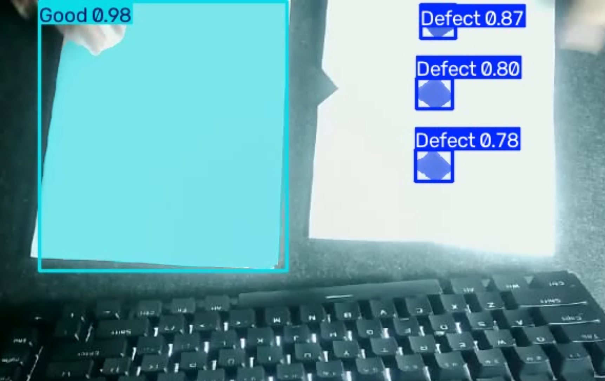
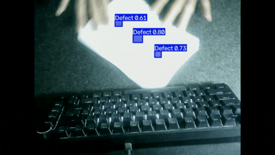

# Defect Segmentation for Product Separation

---

## Business Problem

Manual visual inspection is slow, inconsistent, and prone to human error, especially at high production volumes. A missed defect that reaches the customer can damage trust and lead to returns or complaints, while inconsistent manual grading can make quality control difficult to standardize across shifts.

The client wants to automatically separate defective and good products in real time to maintain consistent product quality and customer satisfaction.

---

## Objective

- Build a program that performs real-time instance segmentation to detect and localize product defects.
- Analyze evaluation metrics to assess model performance and its potential for practical application.

---

## Dataset

The model was initialized using COCO-pretrained YOLOv8n-seg weights and fine-tuned on a custom dataset labeled using Roboflow.

The custom dataset consists of 82 images, split into:

- 72 images (88%) for training
- 7 images (8%) for validation
- 3 images (4%) for testing

The dataset contains two classes: Good and Defect.

Testing was also performed using a real-time camera feed.

### Dataset Characteristics

Camera sources considered for potential deployment include:

- Machine-mounted cameras
- Robotic cameras
- CCTV cameras

The current experiment uses a single-camera setup as a proof of concept.

---

## Exploratory Data Analysis (EDA)

### Key Insights

- The same camera, lighting, and object were used for both training and testing. This controlled setup means that even with a relatively small dataset, the model can still produce strong results under similar conditions. However, this does not guarantee good generalization to unseen environments.
- The defects created for training were relatively easy for the model to detect and segment.
- Polygon masks allow the model to represent the spatial region of defects rather than only predicting bounding boxes.
- A single polygon mask can represent multiple connected defect regions when they belong to the same labeled defect.

---

## Preprocessing

- Used the same input scene and camera setup for the experiment.
- Maintained similar lighting, object position, and camera angle during testing.
- Applied data augmentation during training, including object rotation, blur, saturation, and brightness adjustments.

---

## Modeling

### Architecture Used

Segmentation was performed using a lightweight YOLO variant, specifically `yolov8n-seg.pt`.

---

## Evaluation Metric

- --P (Precision)-- all predicted instances, what fraction are correct? High precision means fewer false positives.
- --R (Recall)-- all actual instances, what fraction did the model find? High recall means fewer false negatives (missed detections).
- --mAP50-- Mean Average Precision at an IoU threshold of 0.50. This is a relatively loose overlap requirement where the prediction needs to reasonably overlap the ground truth.
- --mAP50-95-- mAP averaged across IoU thresholds from 0.50 to 0.95 in steps of 0.05. This is a stricter and more comprehensive metric that rewards predictions with tightly aligned bounding boxes or mask boundaries.

---

## Model Result

| Class  | Images | Instances | Box P | Box R | Box mAP50 | Box mAP50-95 | Mask P | Mask R | Mask mAP50 | Mask mAP50-95 |
| :----- | -----: | --------: | ----: | ----: | --------: | -----------: | -----: | -----: | ---------: | ------------: |
| All    |      7 |        17 | 0.993 | 0.923 |     0.958 |        0.844 |  0.993 |  0.923 |      0.920 |         0.779 |
| Defect |      3 |        13 | 0.987 | 0.846 |     0.922 |        0.719 |  0.987 |  0.846 |      0.845 |         0.589 |
| Good   |      4 |         4 | 0.998 | 1.000 |     0.995 |        0.970 |  0.998 |  1.000 |      0.995 |         0.970 |

At a relatively loose overlap threshold (mAP50), both classes are detected and segmented effectively. However, the gap becomes larger at mAP50-95, particularly for the Defect class.

The Defect class achieves a Mask mAP50 of 84.5% but a Mask mAP50-95 of 58.9%. This indicates that the model can generally identify the defect regions but struggles to produce highly precise mask boundaries at stricter IoU thresholds.

The likely causes are discussed below.

### Screenshot of the Result

### Video of the Result

---

## Key Findings

- Overall, the model performs well across most metrics, with the main weakness being Mask mAP50-95 for the Defect class.
- The Defect class has a significant performance drop from Mask mAP50 (84.5%) to Mask mAP50-95 (58.9%). This suggests that the model can identify the defect region but struggles to produce highly precise mask boundaries at stricter IoU thresholds.
- The lower segmentation performance may be related to imprecise polygon annotations, small defect regions, and blurry images caused by limited camera quality.
- Adjustments to object position, camera angle, lighting, and background may improve performance under different conditions.
- Small defect fragments are sometimes misclassified as part of a Good product, suggesting the need for additional labeled examples, class refinement, or threshold tuning.

---

## Business Insight

- Since the objective is to maintain product quality, high precision is important, because false positives can cause good products to be incorrectly rejected.
- Recall is also important because missed defects can allow defective products to reach customers.
- The model achieved 99.3% overall precision on the available test set, but the test set is very small and therefore not representative enough to claim production-level performance.
- Camera quality and lighting are important factors for visual inspection, so production deployment should prioritize appropriate camera hardware and consistent lighting conditions.
- To prevent small defect fragments from being classified as Good, an additional class such as defect fragment could be introduced.
- The system could also be extended with object counting and production statistics for a more complete quality inspection workflow.

---

## Limitations

- This was an initial experiment, so the dataset was kept small to speed up iteration. As a result, the test set contains only 3 images, which is not statistically representative.
- The model was tested under conditions similar to the training environment, including camera setup, lighting, and object appearance.
- The model was not tested against different backgrounds.
- Performance with fast-moving objects was not evaluated.
- Performance with overlapping objects was not evaluated.
- The current class structure does not fully account for partial or fragmentary defects.
- The model has only been evaluated on defect patterns represented in the custom dataset and should not be expected to reliably detect unseen defect types.

---

## Future Improvements

- Expand the dataset, especially for the Defect class.
- Add more variations of defect types and appearances.
- Add a defect fragment class for small or partial defect regions.
- Improve polygon annotation quality.
- Evaluate performance under different backgrounds, lighting conditions, camera angles, and object orientations.
- Evaluate performance with fast-moving and overlapping objects.
- Add object counting with line-crossing logic to avoid double-counting products on a moving production line.
- Measure inference speed and latency under realistic production conditions.

---

## Tech Stack

- opencv-python==4.10.0.84
- roboflow==1.1.55
- ultralytics==8.3.0

---

## What I Learned (1% Improvement)

- Learned how instance segmentation works.
- Learned not just to detect the "anomaly," but all parts of it.
- Learned how mAP metrics work.
