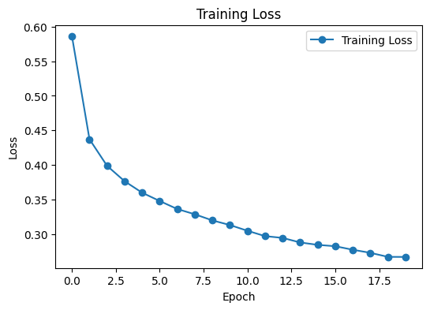

# Fashion MNIST Classification

## Business Problem

Manually sorting and labeling product images is slow and inconsistent, especially for e-commerce platforms that handle thousands of fashion items every day. An automated image classification system can help categorize clothing items faster and reduce manual tagging effort.

---

## Objective

* Build a deep learning model to classify fashion images into their correct category.
* Understand the basic workflow of building, training, and evaluating a neural network.
* Analyze the model performance using training and validation metrics.

---

## Dataset

**Dataset:** `Fashion MNIST` (built-in dataset from `keras.datasets`)

The dataset contains grayscale images of clothing items, each labeled with one of 10 categories (e.g. T-shirt, Trouser, Pullover, Dress, Coat, Sandal, Shirt, Sneaker, Bag, Ankle boot).

### Dataset Characteristics

- 60,000 training images and 10,000 test images
- Each image has a size of 28x28 pixels, grayscale (1 channel)
- 10 unique classes
- Pixel values range from 0 to 255

---

## Exploratory Data Analysis (EDA)

### Key Insights

* The training and test set are already split and balanced across 10 classes.
* Sample visualization shows that each image represents one clothing category clearly enough for a human to recognize.
* No missing values or corrupted images found since the dataset comes pre-cleaned from Keras.

---

## Preprocessing

* Normalized pixel values from the range 0-255 to 0-1 by dividing with 255.0, so the model can converge faster and more stable during training.
* No additional encoding needed since the labels are already in numeric form (0-9).

---

## Modeling

### Architecture Used

A simple Multilayer Perceptron (MLP / Feedforward Neural Network) was built using `keras.Sequential`:

| Layer | Output | Notes |
| :--- | :--- | :--- |
| Flatten | 784 | Convert 28x28 image into a 1D vector |
| Dense | 300 | Activation: ReLU |
| Dropout | 0.3 | Reduce overfitting |
| Dense | 100 | Activation: ReLU |
| Dropout | 0.2 | Reduce overfitting |
| Dense | 10 | Activation: Softmax (output layer) |

### Training Configuration

* Optimizer: Adam
* Loss Function: Sparse Categorical Crossentropy
* Metric: Accuracy
* Epochs: 20
* Validation split: 20% from training data

---

## Model Evaluation

Evaluation metrics used:

* Training Accuracy & Loss
* Validation Accuracy & Loss
* Test Accuracy & Loss

---

## Model Result

| Metric | Score |
| :--- | ---: |
| Final Training Accuracy | 0.90 |
| Final Validation Accuracy | 0.89 |
| Test Accuracy | 0.89 |
| Test Loss | 0.33 |

The training loss and validation loss both show a decreasing trend across 20 epochs, indicating the model is learning properly without severe overfitting, although the gap between training and validation accuracy starts to appear slightly wider in the later epochs.

---

## Key Findings

* A simple MLP architecture can already achieve around 89% accuracy on Fashion MNIST without heavy tuning.
* Dropout layers help reduce overfitting, shown by the validation accuracy that stays close to the training accuracy.
* Normalizing pixel values is a simple but important step for stabilizing the training process.

---

## Business Insight

* This model can act as a baseline for an automated clothing image tagging system.
* An accuracy of ~89% is a good starting point but still needs improvement before being used in production, since misclassification can still happen especially between visually similar classes (e.g. Shirt vs T-shirt, Coat vs Pullover).
* This model should be treated as a proof of concept rather than a final production-ready system.

---

## Final Decision

### Model Used: Simple Feedforward Neural Network (MLP)

### Reasons

* Simple architecture that is easy to build and train as a starting point for deep learning.
* Achieved decent accuracy (~89%) on both validation and test set.
* Fast to train, only takes a few seconds per epoch on this dataset size.

---

## Limitations

* The model only uses a simple MLP, which is not the best architecture for image data since it flattens the image and loses spatial information.
* No callback such as EarlyStopping is used yet, so the training runs for a fixed number of epochs without monitoring overfitting automatically.
* No confusion matrix or per-class evaluation has been done yet, so it is not clear which classes are harder to predict.
* The model has not been tested with external or real-world images outside the Fashion MNIST dataset.

---

## Future Improvements

* Try Convolutional Neural Network (CNN) architecture to better capture spatial pattern in the image.
* Add EarlyStopping and ModelCheckpoint callback during training.
* Add confusion matrix and classification report to see per-class performance.
* Try data augmentation to improve generalization.
* Evaluate the model on external fashion image datasets.

---

## Tech Stack

* Python
* Keras / TensorFlow
* NumPy
* Matplotlib

---

## What I Learned (1% Improvement)

This is my first small step into deep learning after mostly working with classic machine learning before. Here are some things I learned from this simple project:

* Understood the basic deep learning flow: load data, normalize, build the model, compile, train, and evaluate. This flow is simpler than the classic ML pipeline in terms of steps, but each step requires more parameter decisions (layers, neurons, dropout, epochs).
* Learned how `Sequential` API works in Keras, and how each layer connects to the next one.
* Realized that Dropout layer and validation split is useful to prevent the model overfitting.
* Learned that normalization (scaling pixel value to 0-1) is a small step but has a big effect on how fast and stable the training process is.

