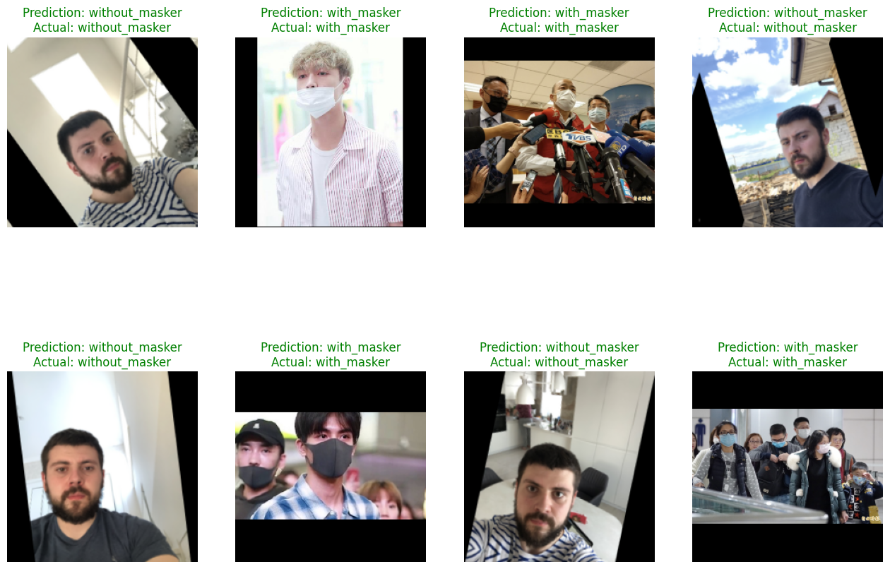
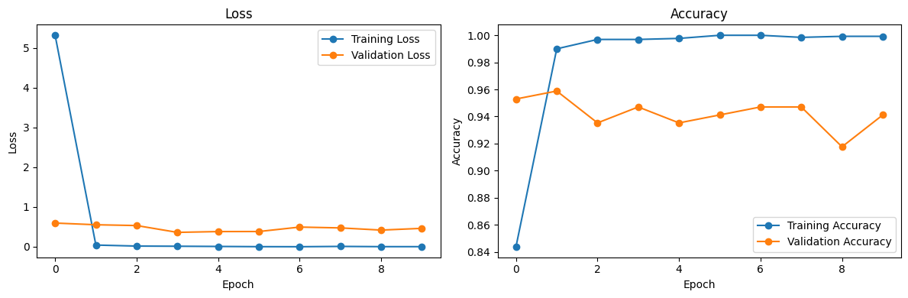

# Face Mask Detection Using Convolutional Neural Networks

## Business Problem

Many organizations require employees and visitors to wear face masks to comply with workplace health and safety regulations. Manually monitoring mask compliance is inefficient and time-consuming. Therefore, an automated image classification system is needed to detect whether a person is wearing a face mask.

---

## Objective

- Build a deep learning model to classify whether a person is wearing a face mask.
- Understand the workflow of building, training, and evaluating a Convolutional Neural Network (CNN).
- Analyze model performance using training and validation metrics.

---

## Dataset

The dataset consists of two classes:

- With Mask
- Without Mask

### Dataset Characteristics

- 853 images in total
- 683 training images
- 170 validation images
- High variation in image dimensions
- Binary classification problem

---

## Exploratory Data Analysis (EDA)

### Key Insights

- The training and validation datasets are already separated.
- The original dataset is imbalanced, so data augmentation was applied to increase the minority class.
- Images have different aspect ratios and resolutions, requiring additional preprocessing before training.
- Sample visualization confirms that images are suitable for binary classification.

---

## Preprocessing

- Normalized pixel values from **0–255** into **0–1** for faster and more stable convergence.
- Applied data augmentation using:
  - RandomFlip
  - RandomRotation
  - RandomZoom
- Used **pad_to_aspect_ratio** to preserve the original image content while converting all images into a uniform input size.

---

## Modeling

### Architecture Used

A Convolutional Neural Network (CNN) was built using `keras.Sequential`.

| Layer | Configuration |
| :--- | :--- |
| Input | 224 × 224 × 3 |
| Conv2D | 128 Filters, ReLU |
| MaxPooling2D | Pool Size = 2×2 |
| Dropout | 0.25 |
| Flatten | - |
| Dense | 128 Units, ReLU |
| Dropout | 0.30 |
| Dense | 1 Unit, Sigmoid |

### Training Configuration

- Optimizer: Adam
- Loss Function: Binary Crossentropy
- Metric: Accuracy
- Epochs: 10

---

## Model Evaluation

Evaluation metrics used:

- Training Accuracy
- Validation Accuracy
- Training Loss
- Validation Loss
- Prediction on unseen images

---

## Model Result

| Metric | Score |
| :--- | ---: |
| Training Accuracy | 99.2% |
| Validation Accuracy | 94.1% |
| Prediction Test | 8 / 8 Correct |

The model correctly classified all eight unseen test images.

The training and validation curves indicate stable learning with only slight overfitting after approximately Epoch 4.

---

## Key Findings

- CNN achieved excellent performance with **94.1% validation accuracy**.
- The gap between training and validation accuracy indicates only mild overfitting.
- Data augmentation effectively improved learning on the imbalanced dataset.
- Image padding successfully handled different image dimensions without cropping important information.
- The learning curve plateaued after approximately Epoch 4, suggesting that fewer epochs may achieve similar performance while reducing training time.

---

## Business Insight

- The model can automate workplace mask compliance monitoring and reduce manual inspection efforts.
- The system can be integrated with CCTV cameras to identify people who are not wearing face masks.
- High-confidence predictions can be used to notify security personnel automatically.

---

## Final Decision

### Best Model: Convolutional Neural Network (CNN)

Reasons:

- Achieved **94.1% validation accuracy**.
- CNN effectively captures spatial features from images compared with traditional neural networks.
- Demonstrated strong generalization despite the relatively small dataset.

---

## Limitations

- CNN requires significantly more computational resources than a simple MLP.
- EarlyStopping and ModelCheckpoint callbacks were not implemented.
- The model has not been evaluated using real CCTV footage or external datasets.
- Confusion matrix and class-wise metrics have not yet been analyzed.

---

## Future Improvements

- Integrate the model into a real-time face mask detection system.
- Add EarlyStopping and ModelCheckpoint callbacks.
- Experiment with additional augmentation techniques such as Gaussian Blur and RandomBrightness.
- Evaluate performance using external datasets and real CCTV images.
- Compare custom CNN with transfer learning models such as MobileNetV2, EfficientNet, and ResNet.

---

## Tech Stack

- Python
- TensorFlow / Keras
- NumPy
- Matplotlib

---

## What I Learned (1% Improvement)

- Learned to use **pad_to_aspect_ratio** when handling datasets with highly varied image dimensions.
- Learned that data augmentation can help reduce class imbalance and improve model generalization.
- Learned that increasing the number of epochs does not always improve performance; identifying the optimal stopping point can save computational time while maintaining accuracy.