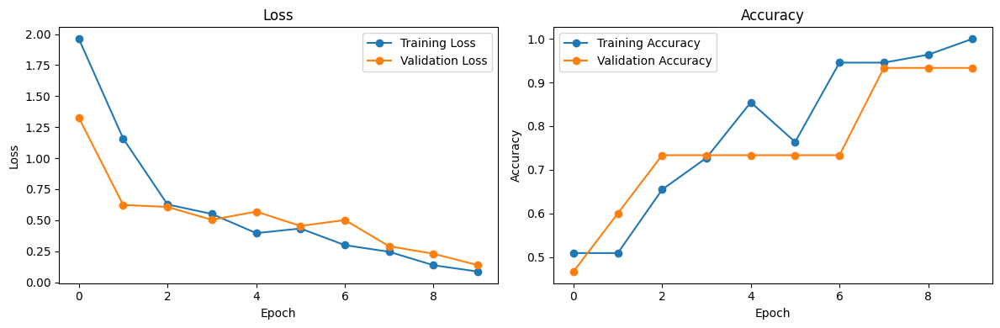

# Rotten Apple Classification Using Convolutional Neural Networks

## Business Problem

Fruit distributors and food processing companies need an automated quality inspection system to distinguish fresh apples from rotten ones. Manual inspection is time-consuming, inconsistent, and difficult to scale, making computer vision a promising solution.

---

## Objective

- Build a deep learning model to classify whether an apple is rotten or fresh.
- Understand the workflow of building, training, and evaluating a Convolutional Neural Network (CNN).
- Analyze model performance using training and validation metrics.

---

## Dataset

The dataset consists of two classes:

- Rotten Apple
- Fresh Apple

### Dataset Characteristics

- 86 images in total
- 55 training images
- 15 validation images
- 16 test images
- Binary classification problem

---

## Exploratory Data Analysis (EDA)

### Key Insights

- The training, validation, and test datasets are already separated into different folders.
- The dataset is intentionally small because it is used for experimentation and learning while reducing computational time.
- Images have different aspect ratios and resolutions, requiring additional preprocessing before training.
- Sample visualization confirms that the images are suitable for binary classification.

---

## Preprocessing

- Normalized pixel values from **0–255** to **0–1** for faster and more stable model convergence.
- Used **pad_to_aspect_ratio** to preserve the original image content while converting all images into a uniform input size.

---

## Modeling

### Architecture Used

A Convolutional Neural Network (CNN) was built using `keras.Sequential`.

| Layer | Configuration |
| :--- | :--- |
| Input | 224 × 224 × 3 |
| Conv2D | 32 Filters, ReLU |
| MaxPooling2D | Pool Size = 2 × 2 |
| Conv2D | 64 Filters, ReLU |
| MaxPooling2D | Pool Size = 2 × 2 |
| Conv2D | 128 Filters, ReLU |
| MaxPooling2D | Pool Size = 2 × 2 |
| Dropout | 0.30 |
| Flatten | - |
| Dense | 128 Units, ReLU |
| Dropout | 0.30 |
| Dense | 1 Unit, Sigmoid |

### Training Configuration

- Optimizer: Nadam
- Loss Function: Binary Crossentropy
- Metric: Accuracy
- Epochs: 10

---

## Model Evaluation

Evaluation metrics used:

- Training Accuracy
- Validation Accuracy
- Training Loss
- Validation Loss
- Prediction on unseen images

---

## Model Result

| Metric | Score |
| :--- | ---: |
| Training Accuracy | 96.3% |
| Validation Accuracy | 93.3% |
| Prediction Test | 8 / 8 Correct |

The model correctly classified all eight unseen test images.

The training and validation curves show a steady decrease in loss and an increase in accuracy, indicating that the model learned effectively throughout the training process.

---

## Key Findings

- The CNN achieved excellent performance with **93.3% validation accuracy**.
- The relatively small gap between training and validation accuracy indicates only mild overfitting.
- Because the dataset is very small, the model is more prone to overfitting. Dropout helped improve generalization, while data shuffling ensured better randomness during training.
- Among the tested optimizers, **Nadam** achieved better performance than Adam and SGD.
- The learning curves suggest that the model converged well after approximately 10 epochs.

---

## Business Insight

- The model can automate the process of distinguishing rotten apples from fresh ones, reducing manual inspection effort.
- This model could be integrated into an automated conveyor belt system to separate rotten and fresh fruit in real time, improving operational efficiency.

---

## Final Decision

### Model Summary

- Achieved **93.3% validation accuracy** on the validation dataset.
- CNN effectively captures spatial features from images compared with traditional fully connected neural networks.
- Demonstrated good generalization despite being trained on a relatively small dataset.

---

## Limitations

- Because the dataset is very small, slight changes to the model architecture or training configuration can noticeably affect performance.
- Limited dataset size restricts extensive hyperparameter tuning.
- The model has not yet been evaluated using external datasets.
- Confusion matrix and class-wise evaluation have not yet been analyzed.

---

## Future Improvements

- Integrate the model into a real-time automated fruit sorting system.
- Experiment with different activation functions such as **Tanh**.
- Evaluate model performance using external datasets.
- Compare the custom CNN with transfer learning models such as MobileNetV2, EfficientNet, and ResNet.

---

## Tech Stack

- Python
- TensorFlow / Keras
- NumPy
- Matplotlib

---

## What I Learned (1% Improvement)

- Learned that using `subset` is unnecessary when the dataset is already separated into training, validation, and test folders.
- Compared different optimizers such as Nadam, Adam, and SGD, and found that Nadam provided the best performance on this dataset.
- Gained a better understanding of how the number of filters, kernel size, and pooling operations influence feature extraction in CNNs.