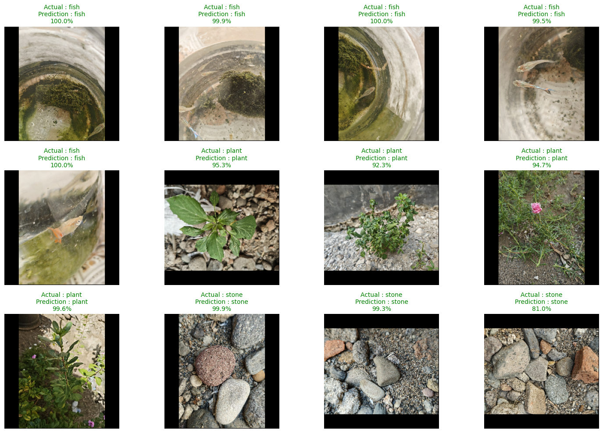
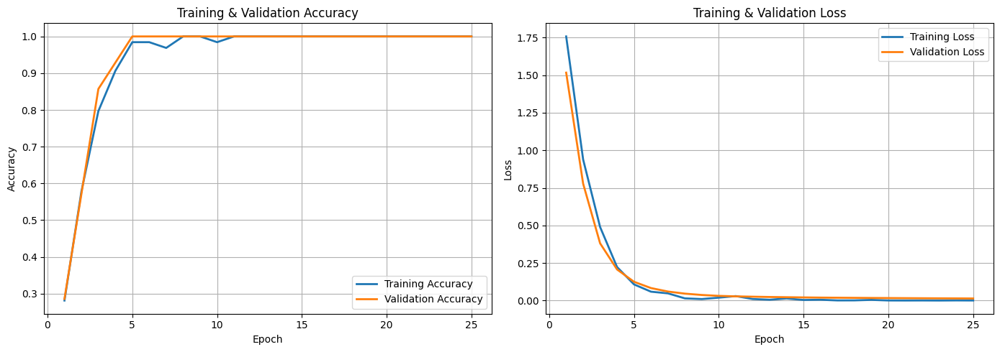

# Multi-Class Object Classification Using ResNet50 Transfer Learning

## Business Problem

The company needs a system to separate visually distinct object categories, so the output can be passed to the next stage of an automated process (e.g., a sorting machine).

---

## Objective

- Build a CNN model to classify three object categories.
- Understand the workflow of building, training, and evaluating a Convolutional Neural Network (CNN).
- Use ResNet50 transfer learning to reduce training time compared to training a CNN from scratch.

---

## Dataset

The dataset consists of three classes:

- Stone
- Fish
- Plant

### Dataset Characteristics

- 92 images in total
- 64 training images
- 14 validation images
- 14 test images
- Multi-class classification problem (3 classes)

---

## Exploratory Data Analysis (EDA)

### Key Insights

- The training, validation, and test sets are already separated into different folders.
- The dataset is intentionally small because it was self-collected to avoid copyright issues.
- Images have varying aspect ratios and resolutions, requiring preprocessing before training.
- Because the dataset is very small, preprocessing and training need to be handled carefully to avoid overfitting.

---

## Preprocessing

- Used prefetching so the GPU and CPU can work in parallel, improving training efficiency.
- Froze all ResNet50 layers so the backbone is not trained from scratch.
- Used `pad_to_aspect_ratio` to preserve the original image content while resizing all images to a uniform input size (avoids distortion from naive resizing).
- Used a callback (early stopping) to halt training if the monitored metric does not improve for 3 consecutive epochs.

---

## Modeling

### Architecture Used

A Convolutional Neural Network (CNN) was built using ResNet50 transfer learning.

| Layer | Configuration |
| :--- | :--- |
| Input | 224 × 224 × 3 |
| Preprocessing | `preprocess_input` (RGB → BGR, zero-centering) |
| ResNet50 | Pre-trained on ImageNet, `include_top=False`, frozen |
| Output Feature Map | 7 × 7 × 2048 |
| GlobalAveragePooling2D | - |
| BatchNormalization | - |
| Dropout | Rate = 0.30 |
| Dense | 3 units, softmax |

### Training Configuration

- Optimizer: Adam, learning rate = 1e-5
- Loss Function: Sparse Categorical Crossentropy
- Metric: Accuracy
- Epochs: 10 (with early stopping)

---

## Model Evaluation

Evaluation metrics used:

- Training/validation accuracy and loss
- Test set accuracy and loss
- Prediction results on the held-out test set

## Model Result

| Metric | Before Tuning | After Tuning |
| :--- | ---: | ---: |
| Accuracy | 100% | 100% |
| Loss | 0.005 | 0.002 |
| Test Prediction | 12 / 12 correct | 12 / 12 correct |

The model correctly classified all held-out test images.

The training and validation curves show a steady decrease in loss and an increase in accuracy, consistent with effective learning during training.

---

## Key Findings

- Transfer learning was very effective on this small dataset. Its benefits are expected to be even more pronounced on larger, more complex datasets.
- ResNet50 gave strong results even without fine-tuning.
- Dropout helped reduce overfitting and encouraged the model to keep learning generalizable features.
- Prefetching improved training speed compared to earlier iterations of this project.
- The model reached 100% accuracy in fewer than 10 epochs, likely because the three classes (stone, fish, plant) are visually very distinct, making this an easy classification task rather than strong evidence of the model's general capability (see Limitations).

---

## Business Insight

- The model separates the three categories reliably, and could potentially be integrated with a downstream sorting or automation system.
- Using a frozen, pre-trained ResNet50 backbone kept computational cost low while still producing strong results, which could help reduce compute resource requirements in a production setting.

---

## Final Decision

### Model Summary

- Achieved 100% accuracy on this small, easy-to-separate test set.
- CNNs are well suited to capturing spatial features from images, compared to traditional fully connected networks.
- CNN with transfer learning can produce strong results even on a very small dataset, though this result should be interpreted cautiously (see Limitations).

---

## Limitations

- The dataset is very small and the three classes are visually very distinct, so this result does not demonstrate how the model performs on harder, more realistic classification problems.
- Limited dataset size restricts extensive hyperparameter tuning and makes the accuracy/loss numbers less statistically reliable.
- The model has not yet been evaluated on an external or more challenging dataset.

---

## Future Improvements

- Integrate the model into a real-time automated sorting system.
- Expand the dataset, both in size and in the difficulty/similarity of classes.
- Evaluate model performance on external datasets.
- Compare this transfer learning approach against MobileNetV2 and EfficientNet.

---

## Tech Stack

- Python
- TensorFlow / Keras
- NumPy
- Matplotlib

---

## What I Learned

- Prefetching lets the CPU and GPU run in parallel instead of waiting on each other, improving training throughput.
- Transfer learning can save significant training time while still producing strong results, without training a model from scratch.
- Learned the purpose of Global Average Pooling, Batch Normalization, and Dropout in a transfer-learning head.
- Learned the general transfer learning workflow: freezing the pre-trained backbone, then replacing and training a new "head" (classification layers) on the target dataset.