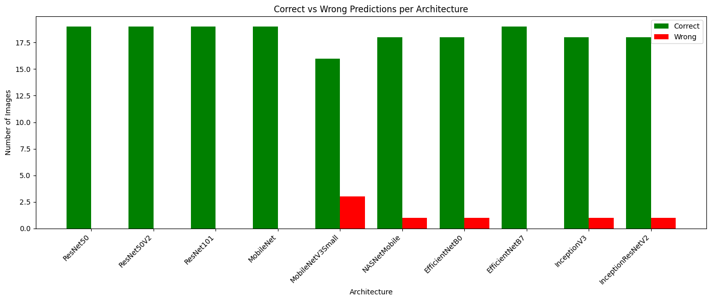
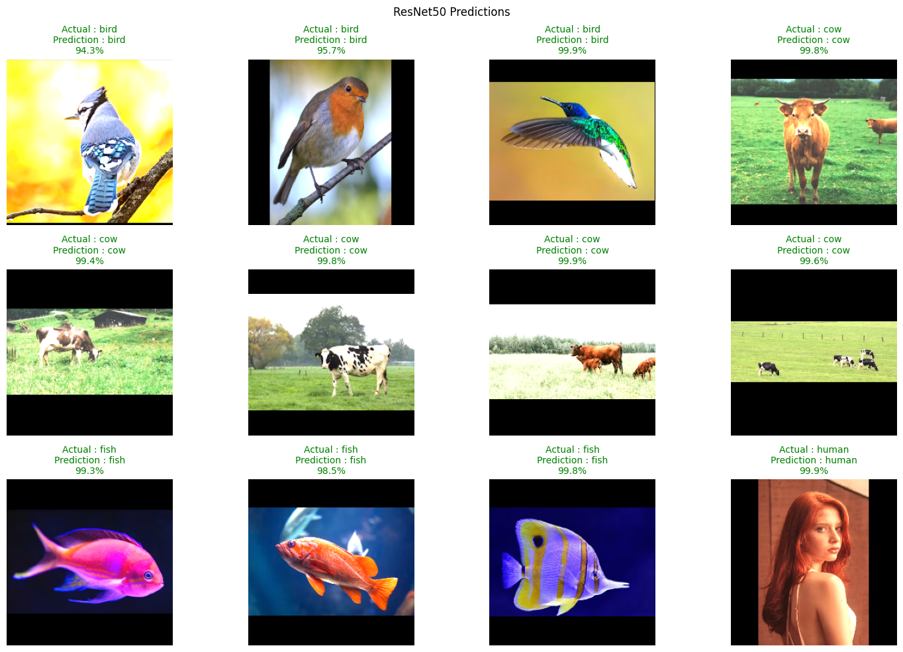
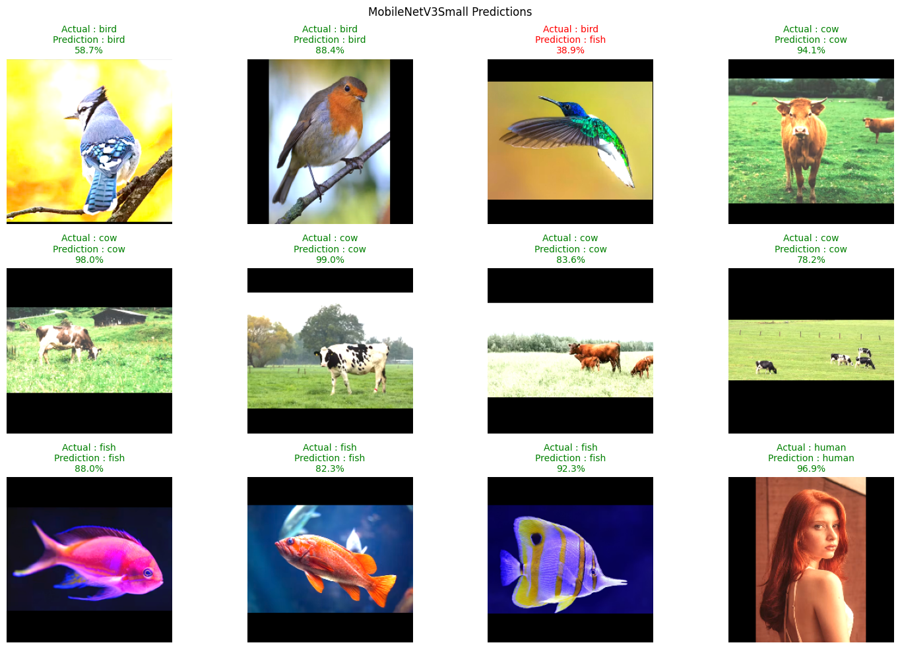
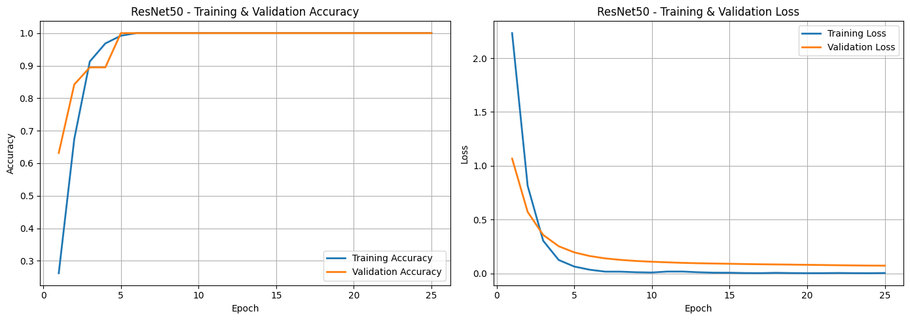

# Benchmarking Transfer Learning Architectures on a Small Image Dataset

> **Disclaimer**
> The notebook was developed with assistance from Claude (Generative AI) for approximately 80% of the implementation to accelerate coding. My contribution focused on defining the project objectives, designing the experimental workflow, analyzing the results, validating the implementation, code evaluation, and revising the final solution.

---

## Business Problem

Before deploying an image classification system into production, the company needs to determine which transfer learning architecture provides the best balance between prediction performance and computational efficiency. Benchmarking multiple architectures under identical experimental settings helps reduce deployment risk and supports selecting the most suitable backbone.

---

## Objective

- Benchmark multiple transfer learning architectures under identical experimental settings.
- Compare their performance to identify the most suitable backbone for a small image dataset.
- Ensure a fair comparison by using the same dataset split, preprocessing pipeline, optimizer, training configuration, and classification head for every model.
- Evaluate the impact of fine-tuning on each architecture.

---

## Dataset

The dataset consists of five classes:

- Bird
- Cow
- Fish
- Human
- Snake

### Dataset Characteristics

- 164 images in total
- 129 training images
- 19 validation images
- 19 test images
- Multi-class classification problem (5 classes)

---

## Exploratory Data Analysis (EDA)

### Key Insights

- The training, validation, and test datasets were already separated into different folders.
- The dataset was intentionally kept small and manually collected from Unsplash using freely licensed images.
- Images have varying aspect ratios and resolutions, requiring preprocessing before training.
- Because the dataset is relatively small, careful preprocessing and model selection are necessary to reduce overfitting.

---

## Preprocessing

- Used **prefetching** so the CPU and GPU can work in parallel, improving training efficiency.
- Froze all backbone layers so feature extraction relied on ImageNet pre-trained weights.
- Used `pad_to_aspect_ratio` to preserve image content while resizing images into a uniform input size.
- Applied architecture-specific `preprocess_input`, since each transfer learning model expects a different input normalization strategy.

---

## Modeling

### Architecture Used

A Convolutional Neural Network (CNN) benchmark was conducted using ten transfer learning architectures. Every architecture used exactly the same dataset split, optimizer, training configuration, and classification head to ensure a fair comparison.

| Backbone | Preprocessing | Output Feature Map |
| :--- | :--- | :--- |
| ResNet50 | RGB → BGR, Zero-Centering | 7 × 7 × 2048 |
| ResNet50V2 | Scale to [-1, 1] | 7 × 7 × 2048 |
| ResNet101 | RGB → BGR, Zero-Centering | 7 × 7 × 2048 |
| MobileNet | Scale to [-1, 1] | 7 × 7 × 1024 |
| MobileNetV3Small | Scale to [-1, 1] | 7 × 7 × 576 |
| NASNetMobile | Scale to [-1, 1] | 7 × 7 × 1056 |
| EfficientNetB0 | Built into model (input kept 0–255) | 7 × 7 × 1280 |
| EfficientNetB7 | Built into model (input kept 0–255) | 7 × 7 × 2560 |
| InceptionV3 | Scale to [-1, 1] | 5 × 5 × 2048 |
| InceptionResNetV2 | Scale to [-1, 1] | 5 × 5 × 1536 |

### Shared Configuration

- Input Size: **224 × 224 × 3**
- Base Model: ImageNet pre-trained (`include_top=False`, frozen)
- Classification Head:
  - GlobalAveragePooling2D
  - BatchNormalization
  - Dropout (0.30)
  - Dense (5 Units, Softmax)

### Training Configuration

- Optimizer: Adam (Learning Rate = 1e-5)
- Loss Function: Sparse Categorical Crossentropy
- Metric: Accuracy
- Epochs: 10

---

## Model Evaluation

Evaluation metrics used:

- Training Accuracy
- Validation Accuracy
- Training Loss
- Validation Loss
- Prediction on held-out test images

---

## Model Result

| Model | Accuracy (Before Tuning) | Accuracy (After Tuning) | Validation Accuracy | Loss (Before Tuning) | Loss (After Tuning) |
| :--- | ---: | ---: | ---: | ---: | ---: |
| ResNet50 | 100% | 100% | 100% | 0.108 | 0.011 |
| ResNet50V2 | 89.47% | 100% | 89.47% | 0.262 | 0.045 |
| ResNet101 | 89.47% | 100% | 94.74% | 0.319 | 0.015 |
| MobileNet | 84.21% | 100% | 100% | 0.330 | 0.047 |
| MobileNetV3Small | 73.68% | 84.21% | 84.21% | 0.656 | 0.353 |
| NASNetMobile | 94.74% | 94.74% | 94.74% | 0.321 | 0.231 |
| EfficientNetB0 | 89.47% | 94.74% | 84.21% | 0.472 | 0.310 |
| EfficientNetB7 | 94.74% | 100% | 94.74% | 0.502 | 0.279 |
| InceptionV3 | 84.21% | 94.74% | 94.74% | 0.343 | 0.129 |
| InceptionResNetV2 | 94.74% | 94.74% | 100% | 0.152 | 0.178 |

After fine-tuning, **ResNet50, ResNet50V2, ResNet101, MobileNet, and EfficientNetB7** achieved **100% test accuracy**. Among them, **ResNet50** demonstrated the most consistent performance because it already achieved perfect accuracy before fine-tuning while also producing the lowest final loss.

However, these results should be interpreted carefully because the evaluation was performed on only **19 test images**, meaning a single incorrect prediction would change the accuracy by more than 5%.

### Architecture Comparison

### Best Performing Model (ResNet50)

### Lowest Performing Model (MobileNetV3Small)

The learning curves show a steady decrease in loss and an increase in accuracy across architectures, indicating stable convergence during training.

---

## Key Findings

- Under identical experimental settings, **ResNet50** achieved the strongest overall performance.
- Fine-tuning improved most architectures, with **5 out of 10** models reaching **100% test accuracy** only after fine-tuning.
- On this small dataset, **ResNet50 outperformed the deeper ResNet101**, suggesting that additional network depth did not provide further benefits.
- Several architectures converged in fewer than 10 epochs, indicating that ImageNet pre-trained features transferred effectively to this classification task.
- MobileNetV3Small delivered the lowest accuracy but offers a lightweight architecture suitable for resource-constrained environments.
- Because the dataset is small and visually distinct, these benchmark results should not be generalized to more challenging real-world datasets.

---

## Business Insight

- **ResNet50** is the recommended architecture for deployment in similar small-scale classification tasks because it consistently achieved the best balance between accuracy and loss.
- When inference speed or hardware limitations are more important than maximum accuracy, **MobileNetV3Small** may be considered as an alternative.
- Benchmarking multiple transfer learning architectures before deployment helps reduce engineering risk by selecting a backbone based on empirical evidence rather than assumptions.

---

## Final Decision

### Recommended Architecture: ResNet50

### Reasons

- Achieved the best overall performance across the benchmark.
- Reached **100% test accuracy** both before and after fine-tuning.
- Produced the lowest loss among all evaluated architectures.
- Fine-tuning significantly improved several architectures and should be evaluated during model development rather than being automatically skipped.

---

## Limitations

- The dataset is relatively small, making the reported performance less representative of real-world scenarios.
- The object categories are visually distinct, resulting in a relatively easy classification task.
- With only **19 test images**, accuracy estimates have high variance.
- The benchmark results may differ substantially when evaluated on larger or more challenging datasets.
- The models have not yet been evaluated using external datasets.

---

## Future Improvements

- Expand the dataset with more images and more challenging object categories.
- Compare architectures on medium and large-scale datasets.
- Measure inference time, memory usage, and computational efficiency.
- Evaluate performance using external datasets.
- Deploy the selected architecture in a real-time image classification pipeline.

---

## Tech Stack

- Python
- TensorFlow / Keras
- NumPy
- Matplotlib

---

## What I Learned (1% Improvement)

- Learned how to benchmark multiple transfer learning architectures under identical experimental conditions.
- Understood that deeper architectures do not always outperform shallower ones on small datasets.
- Learned how architecture-specific `preprocess_input` functions affect transfer learning workflows.
- Gained practical experience with freezing pre-trained backbones and training only the classification head.
- Learned that fine-tuning should be validated experimentally because its impact varies across architectures.
- Understood the importance of interpreting high accuracy carefully when the evaluation dataset is very small.