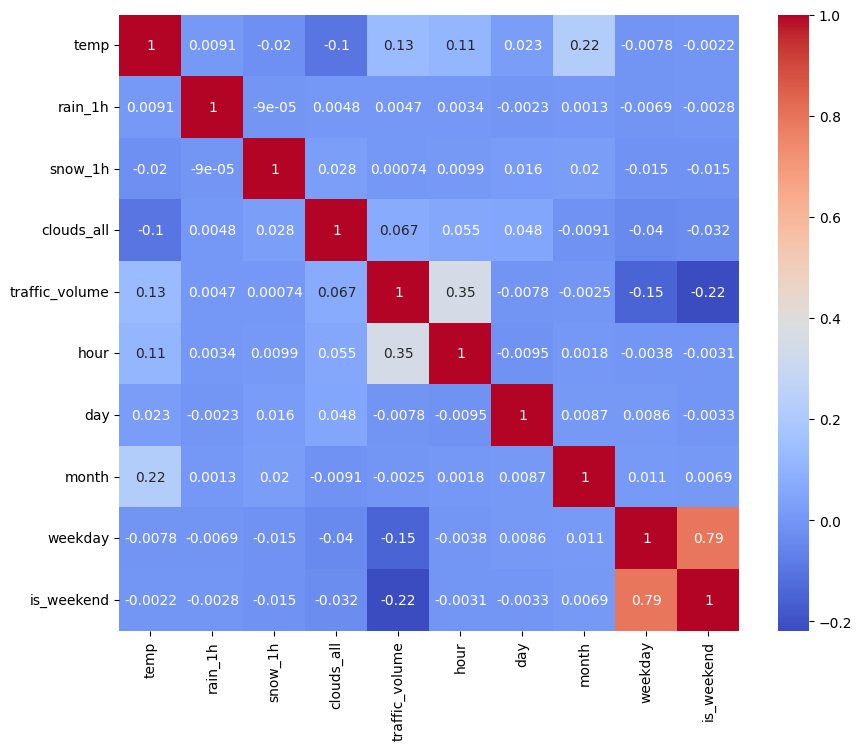
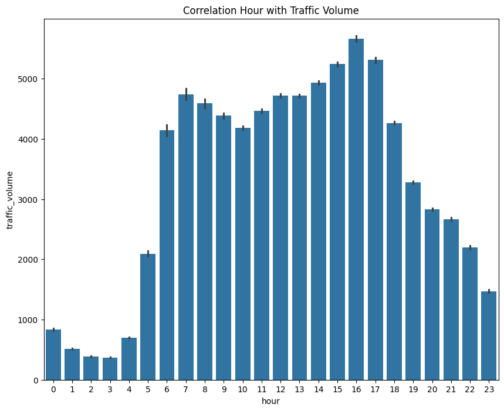

# Traffic Volume Forecasting for Logistics Planning

## Project Overview

This project aims to forecast traffic volume for specific time periods to support logistics and delivery planning.

---

## Business Problem

The company plans to deliver products during the New Year period but is concerned about traffic congestion that could delay deliveries and affect product quality.

---

## Objective

- Build forecasting models to predict traffic volume and help avoid traffic congestion
- Discover hidden patterns between weather conditions and traffic volume
- Compare multiple regression models

---

## Dataset

Dataset: Traffic_Volume.csv.gz

The dataset contains traffic and weather information, including:

- temp
- snow_1h
- weather_description
- date_time

### Dataset Characteristics

The dataset contains 48,204 observations and 9 features. Only one feature contains missing values. Several duplicate records were identified and removed. Many features show weak correlations with the target variable.

---

## Exploratory Data Analysis (EDA)

### Key Insights

- The holiday feature contains 99.87% missing values and was removed due to limited usefulness.
- The date_time feature was used to extract temporal features, particularly hour, for forecasting New Year traffic volume.
- Traffic volume exhibits high variability over time, making robust ensemble methods such as boosting and bagging suitable for this problem.

---

## Modeling

### Algorithms Evaluated

- Linear Regression, used as a simple baseline model for comparison
- Hist Gradient Boosting Regressor, handles complex relationships efficiently and is generally faster and more accurate than traditional Gradient Boosting
- Random Forest Regressor, uses a bagging approach that provides strong performance on tabular data

---

## Preprocessing

- OneHotEncoder, applied to categorical features with relatively low cardinality and integrated into a machine learning pipeline
- RobustScaler, applied to Linear Regression to reduce sensitivity to outliers without requiring additional transformations

---

## Model Evaluation

Metrics used:

- Mean Absolute Error (MAE)
- R² Score

---

## Model Comparison

### Metric Evaluation for Each Model

| Model                  |     MAE |     R² |
| :--------------------- | ------: | -----: |
| Hist Gradient Boosting |  257.16 | 0.9496 |
| Random Forest          |  276.45 | 0.9387 |
| Linear Regression      | 1548.07 | 0.1943 |

### Feature Importance (Best Model)

| Feature        | Importance |
|:---------------|-----------:|
| hour           |   150.2187 |
| is_weekend     |    98.3925 |
| temp           |    23.1149 |
| weather_main   |    18.8856 |
| clouds_all     |     8.2668 |
| month          |     0.1934 |
| rain_1h        |     0.0002 |
| snow_1h        |     0.0000 |
| day            |    -0.0263 |
| weekday        |    -0.1121 |

### Correlation Hour vs Traffic Volume

### Traffic Volume Forecast Using the Best Model (Hist Gradient Boosting)

Volumes above 3,400 are classified as traffic jam based on the 75th percentile of historical data.

| Date       | Avg Volume | Status      |
| :--------- | ---------: | :---------- |
| 2027-01-01 |       2326 | Smooth      |
| 2027-01-02 |       2430 | Smooth      |
| 2027-01-03 |       2111 | Smooth      |
| 2027-01-04 |       2950 | Smooth      |
| 2027-01-05 |       3258 | Smooth      |
| 2027-01-06 |       3455 | Traffic Jam |
| 2027-01-07 |       3527 | Traffic Jam |

---

## Key Findings

- Hist Gradient Boosting achieved the best predictive performance among all evaluated models.
- Linear Regression struggled to capture the complex relationships in the dataset due to weak feature correlations and non-linear patterns.
- Using a sequential split instead of a random train-test split produced more realistic results and prevented data leakage.
- Based on the forecast results, traffic volume remains relatively low from January 1 to January 5 due to holiday periods. Traffic volume increases significantly on January 6 and 7 as people return to work.
- Feature importance analysis and correlation heatmaps revealed that temporal features, especially hour, have strong predictive power. This explains the model's high R² score and low MAE, as traffic patterns vary significantly throughout the day.

---

## Business Insight

- Hist Gradient Boosting can be used as a reliable tool for forecasting traffic volume and supporting logistics planning.
- Based on the forecast results, product deliveries should be prioritized during January 1–5 to minimize the risk of traffic congestion.
- Delivery schedules should prioritize off-peak hours to further reduce transportation delays.

---

## Final Decision

### Best Model: Hist Gradient Boosting Regressor

Reasons:

- Achieved the lowest MAE (257.16) and the highest R² score (0.9496)
- Effectively captured complex, non-linear relationships within the dataset
- Performed well despite weak correlations among the original features
- Delivered strong predictive performance with relatively fast training time

---

## Limitations

- The original features exhibit relatively weak correlations with the target variable, requiring feature extraction to improve predictive performance.
- Additional external features may further improve forecasting accuracy.
- Model performance has not yet been validated on external datasets or real-world production environments.

---

## Future Improvements

- Explore additional feature engineering techniques
- Evaluate regularization methods such as Lasso and Elastic Net
- Conduct more extensive hyperparameter tuning
- Validate model performance using external datasets

---

## Tech Stack

- Python
- Pandas
- NumPy
- Scikit-Learn
- Matplotlib
- Seaborn

---

## What I Learned (1% Improvement)

- Learned that temporal feature extraction from datetime can compensate for weak raw feature correlations, significantly improving model performance
- Learned that using train_test_split() with the default shuffle=True is not always appropriate; in time series problems, sequential splitting is necessary to avoid data leakage
- Tried feature extraction techniques when working with datasets that have low feature-target correlations