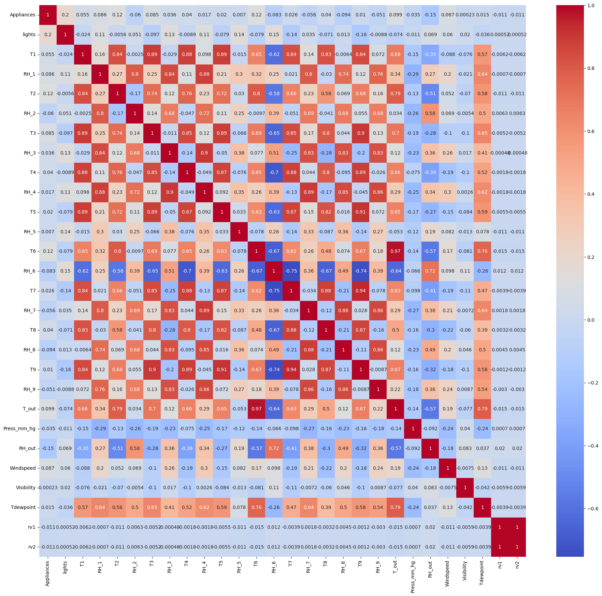

# Household Energy Consumption Prediction

## Project Overview

This project aims to predict household appliance energy consumption for specific time periods to support energy monitoring and budgeting decisions.

---

## Business Problem

Households want to estimate how much energy they will consume in the next several hours so they can determine whether energy-saving actions are necessary.

---

## Objective

* Build prediction models to estimate appliance energy consumption
* Discover hidden patterns between environmental conditions and energy usage
* Compare multiple machine learning models to identify the best-performing approach

---

## Dataset

Dataset: `energy.csv`

The dataset contains household energy and environmental measurements, including:

* Temperature
* Appliances (target)
* Pressure
* Dew Point
* Humidity
* Other environmental variables

### Dataset Characteristics

The dataset contains 19,735 observations and 29 features. No missing values or duplicate records were found. Several features contain valid outliers that represent actual observations, so no outlier removal was performed. Most features are numerical and do not require encoding.

---

## Exploratory Data Analysis (EDA)

### Key Insights

* Correlations between individual features and the target variable are generally weak, with the `lights` feature showing the highest correlation at approximately 20%.
* Feature engineering is necessary to extract useful temporal patterns from the datetime feature.
* Valid outliers are present in the dataset, making RobustScaler an appropriate preprocessing technique.

---

## Preprocessing

* Datetime parsing to extract temporal information from the date feature
* Feature engineering by creating `hour`, `weekday`, and `month` features
* Cyclical encoding using sine and cosine transformations to preserve the periodic nature of time-based features
* RobustScaler applied to reduce sensitivity to valid outliers
* Removed `rv1` and `rv2` because they represent random variables and provide little predictive value

---

## Modeling

### Algorithms Evaluated

* Linear Regression, used as a simple baseline model for comparison
* Hist Gradient Boosting Regressor, handles complex non-linear relationships efficiently and is generally faster than traditional Gradient Boosting
* Random Forest Regressor, robust against outliers and capable of capturing non-linear interactions
* Extra Trees Regressor, similar to Random Forest but introduces additional randomness that can improve performance on low-correlation datasets
* Lasso Regression, applies L1 regularization to reduce model complexity
* Elastic Net Regression, combines L1 and L2 regularization techniques

---

## Model Evaluation

Metrics used:

* Mean Absolute Error (MAE)
* R² Score

---

## Model Comparison

### Metric Evaluation for Each Model

| Rank | Model                   |     MAE | R² Score |
| ---: | ----------------------- | ------: | -------: |
|    1 | Extra Trees Regressor   | 27.0188 |   0.6331 |
|    2 | Random Forest Regressor | 30.4334 |   0.5831 |
|    3 | Hist Gradient Boosting  | 36.5161 |   0.4751 |
|    4 | Linear Regression       | 51.4276 |   0.1999 |
|    5 | Lasso                   | 51.5124 |   0.1770 |
|    6 | Elastic Net             | 53.1884 |   0.1264 |

### Appliance Energy Consumption Prediction Using the Best Model (Extra Trees Regressor)

| DateTime            | Appliances Predicted |
| :------------------ | -------------------: |
| 2026-06-23 00:00:00 |                105.2 |
| 2026-06-23 01:00:00 |                110.5 |
| 2026-06-23 02:00:00 |                109.6 |
| 2026-06-23 03:00:00 |                128.7 |
| 2026-06-23 04:00:00 |                139.0 |
| 2026-06-23 05:00:00 |                156.6 |
| 2026-06-23 06:00:00 |                205.1 |
| 2026-06-23 07:00:00 |                223.4 |
| 2026-06-23 08:00:00 |                257.0 |
| 2026-06-23 09:00:00 |                255.0 |
| 2026-06-23 10:00:00 |                251.5 |
| 2026-06-23 11:00:00 |                255.3 |
| 2026-06-23 12:00:00 |                236.5 |
| 2026-06-23 13:00:00 |                228.5 |
| 2026-06-23 14:00:00 |                227.2 |
| 2026-06-23 15:00:00 |                230.2 |
| 2026-06-23 16:00:00 |                229.5 |
| 2026-06-23 17:00:00 |                284.9 |
| 2026-06-23 18:00:00 |                430.0 |
| 2026-06-23 19:00:00 |                216.6 |
| 2026-06-23 20:00:00 |                141.0 |
| 2026-06-23 21:00:00 |                123.1 |
| 2026-06-23 22:00:00 |                 89.5 |
| 2026-06-23 23:00:00 |                 93.6 |

---

## Key Findings

* Extra Trees Regressor achieved the best predictive performance among all evaluated models.
* Linear models (Linear Regression, Lasso, and Elastic Net) struggled to capture the non-linear relationships within the dataset, resulting in relatively low R² scores.
* Temporal feature engineering significantly improved model performance by extracting useful information from the datetime feature.
* Cyclical encoding helped the models better understand recurring daily and weekly energy consumption patterns.

---

## Business Insight

* Extra Trees Regressor can be used as a practical tool for estimating household energy consumption.
* Predicted energy usage can help households identify periods of unusually high consumption and encourage energy-saving actions.
* Understanding daily consumption patterns allows users to optimize appliance usage and improve energy efficiency.

---

## Final Decision

### Best Model: Extra Trees Regressor

Reasons:

* Achieved the lowest MAE (27.02) and highest R² Score (0.63)
* Effectively captured complex non-linear relationships within the dataset
* Outperformed other ensemble and linear models
* Faster than Random Forest due to its additional randomization strategy
* Demonstrated strong performance despite relatively weak feature-target correlations

---

## Limitations

* Most features exhibit weak correlations with the target variable.
* Additional energy-related features may further improve predictive performance.
* Random split may overestimate model performance compared to a proper time-based evaluation.
* No lag features were included, limiting the model's ability to capture temporal dependencies directly.
* The model has not been validated on external datasets or production environments.

---

## Future Improvements

* Add lag features to capture historical energy consumption patterns and enable proper temporal validation
* Explore additional feature engineering techniques
* Perform more extensive hyperparameter tuning
* Evaluate the model using time-based validation strategies
* Validate performance on external datasets

---

## Tech Stack

* Python
* Pandas
* NumPy
* Scikit-Learn
* Matplotlib
* Seaborn

---

## What I Learned (1% Improvement)

* Trying new models Extra Tree, Lasso, and Elastic Net. Extra tree give good results for dataset with low correlation, instead Laaso and Elastic Net give bad result.
