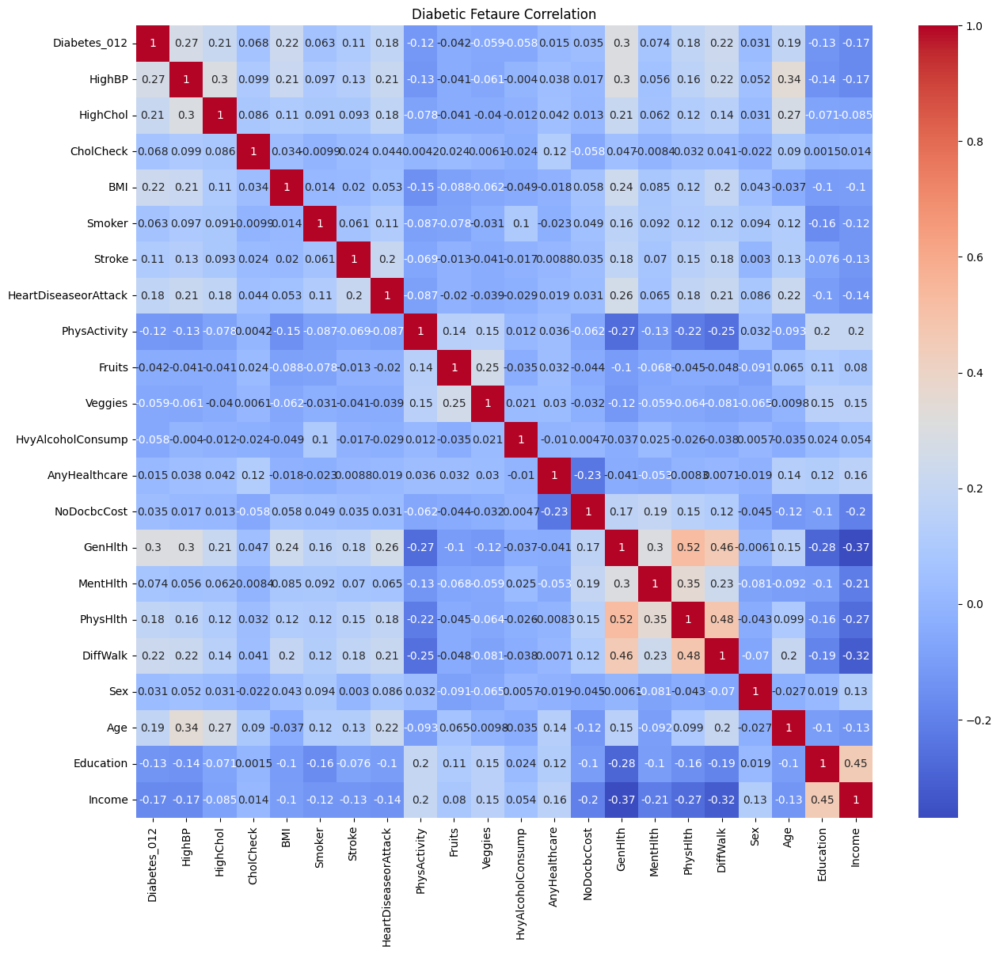

# Preventive Diabetes Classification 

## Business Problem

Early identification of individuals at risk of diabetes is essential for supporting preventive healthcare and improving resource allocation. Manual screening can be time-consuming, while machine learning can assist healthcare professionals by identifying patients who are more likely to develop diabetes based on their health indicators.

---

## Objective

* Build classification models to predict whether a patient has diabetes.
* Identify important health factors associated with diabetes.
* Discover hidden patterns among health indicators such as age, blood pressure, BMI, smoking habits, and other medical attributes.
* Compare multiple machine learning models to determine the most suitable approach for diabetes prediction.

---

## Dataset

**Dataset:** `diabetes.csv`

The dataset contains various health measurements and lifestyle-related information, including:

* HighBP
* HighChol
* BMI
* Smoker
* Age
* Etc.

### Dataset Characteristics

- 253,680 instances
- 22 features, consisting of a mix of binary/categorical health indicators (e.g., HighBP, HighChol, Smoker) and continuous numerical variables (e.g., BMI, Age), all encoded numerically
- No missing values
- No duplicate records
- Several features contain valid outliers representing actual patient observations; therefore, no outlier removal was performed.

---

## Exploratory Data Analysis (EDA)

### Key Insights

* All features are numerically encoded, eliminating the need for categorical encoding.
* Several features contain valid outliers. Instead of removing them, **RobustScaler** was applied to reduce their influence while maintaining valuable information.
* Most features exhibit relatively weak linear correlations with the target variable. The strongest correlation is approximately **0.30**, observed with **GenHlth (General Health)**.
* The weak linear relationship suggests that diabetes prediction may involve complex non-linear interactions, motivating the use of ensemble tree-based models such as Hist Gradient Boosting, Random Forest, and CatBoost.

---

## Preprocessing

* Applied **RobustScaler** across all features to reduce the influence of valid outliers while maintaining a consistent preprocessing pipeline.
* Performed **Grid Search** and **Randomized Search** to optimize hyperparameters and compare model performance before and after tuning.

---

## Modeling

### Algorithms Evaluated

### Hist Gradient Boosting Classifier
Efficiently captures complex non-linear relationships while offering fast training performance on large datasets.

### Random Forest Classifier
Robust against outliers and capable of modeling complex feature interactions through ensemble learning.

### CatBoost Classifier
Gradient boosting algorithm designed for high predictive performance with minimal parameter tuning. Although particularly effective with categorical features, it also performs competitively on fully numerical datasets.

---

## Model Evaluation

Evaluation metrics used:

* Accuracy
* Precision
* Recall
* F1-Score
* Classification Report

---

## Model Comparison

### Metric Evaluation for Each Model Without Hyperparameter Tuning

| Rank | Model                            | Accuracy | Precision | Recall | F1-Score |
| ---: | :------------------------------- | -------: | --------: | -----: | -------: |
|    1 | Hist Gradient Boosting Classifier|     0.85 |      0.81 |   0.85 |     0.81 |
|    2 | Cat Boost Classifier             |     0.85 |      0.81 |   0.85 |     0.81 |
|    3 | Random Forest Classifier         |     0.84 |      0.79 |   0.84 |     0.81 |

### Metric Evaluation for Each Model With Hyperparameter Tuning

| Rank | Model                            | Accuracy | Precision | Recall | F1-Score |
| ---: | :------------------------------- | -------: | --------: | -----: | -------: |
|    1 | Cat Boost Classifier             |     0.85 |      0.81 |   0.85 |     0.81 |
|    2 | Hist Gradient Boosting Classifier|     0.85 |      0.81 |   0.85 |     0.81 |
|    3 | Random Forest Classifier         |     0.85 |      0.80 |   0.85 |     0.81 |

---

## Key Findings

* CatBoost and Hist Gradient Boosting achieved nearly identical predictive performance.
* Hyperparameter tuning produced only marginal improvements, indicating that the default models were already well suited to this dataset.
* Using RobustScaler slightly improved model consistency while maintaining a unified preprocessing workflow.
* Randomized Search required significantly less computational time than Grid Search while producing comparable optimization results.

---

## Business Insight

* The trained models can support early diabetes screening by identifying individuals who are more likely to have diabetes.
* In healthcare applications, **Recall** is one of the most important evaluation metrics because failing to identify diabetic patients (false negatives) may delay further medical examination.
* These models should be used as **decision support tools**, helping healthcare professionals prioritize patients for additional testing rather than replacing medical diagnosis.

---

## Final Decision

### Best Model: Hist Gradient Boosting Classifier

### Reasons

* Achieved competitive predictive performance across all evaluation metrics.
* Produced high Recall (85%), making it suitable for preventive screening tasks.
* Effectively captured complex non-linear relationships within the dataset.
* Required lower computational cost than CatBoost while maintaining nearly identical predictive performance.

---

## Limitations

* Most features exhibit relatively weak linear correlations with the target variable, limiting the effectiveness of simpler linear models such as Logistic Regression.
* External validation using independent datasets has not yet been performed.
* Hyperparameter optimization required considerable computational resources.
* The model has not been deployed or evaluated in a production environment.

---

## Future Improvements

* Explore additional feature engineering techniques.
* Compare performance with XGBoost and Extra Trees Classifier.
* Add Feature Importance and SHAP analysis for model interpretability.
* Evaluate the model on external datasets to assess generalization.
* Deploy the model as a simple prediction web application.

---

## Tech Stack

* Python
* Pandas
* NumPy
* Scikit-Learn
* Matplotlib
* Seaborn

---

## What I Learned (1% Improvement)

* Applied Grid Search and Randomized Search for hyperparameter optimization.
* Gained a better understanding of balancing predictive performance with computational efficiency.