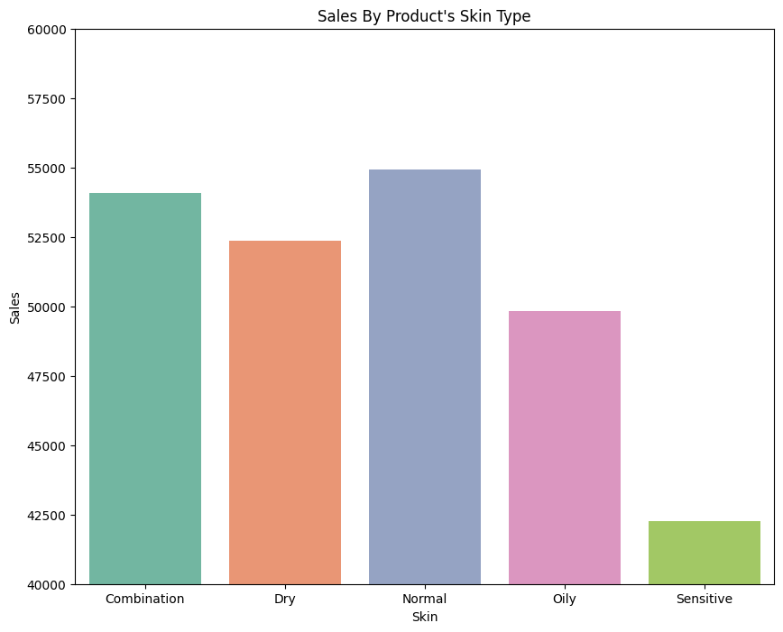
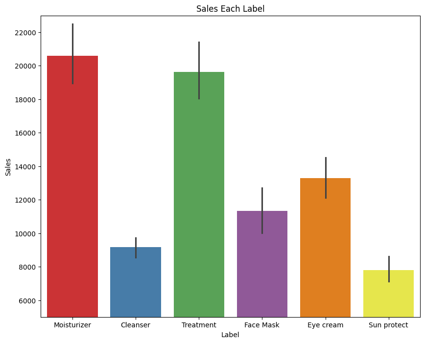
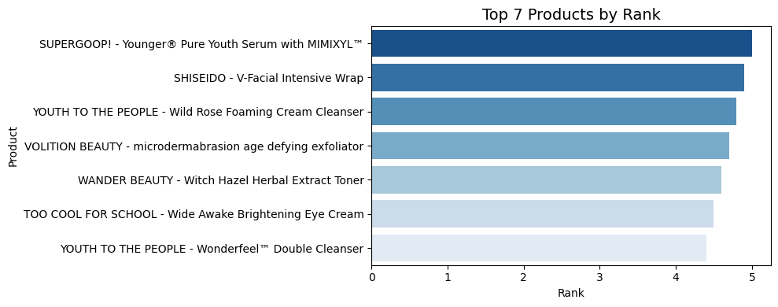
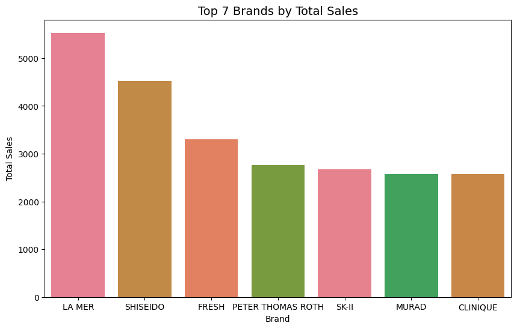

# Multi-Label Skin Type Suitability Classification from Cosmetic Ingredients

## Business Problem

Selecting cosmetic products that match a customer's skin type can be challenging because certain ingredients may cause irritation or discomfort for specific skin types. An automated classification system can help companies recommend suitable products more accurately, reducing the risk of inappropriate recommendations and improving customer satisfaction.

In addition, companies can analyze high-performing brands and products to identify successful ingredient combinations and support future product development.

---

## Objective

- Build machine learning models to classify cosmetic products suitable for multiple skin types.
- Discover hidden patterns among ingredients, brands, product labels, rankings, and skin-type suitability.
- Identify the top-performing brands and products through exploratory data analysis.
- Compare multiple machine learning algorithms to determine the most suitable approach for multi-label classification.

---

## Dataset

**Dataset:** `cosmetics.csv`

**Source:** UCI Machine Learning Repository

The dataset contains cosmetic product information, including:

- Ingredients
- Product Label
- Brand
- Price
- Rank
- Skin Type
- Etc.

### Dataset Characteristics

- 1,472 instances
- 11 features
- No missing values
- No duplicate records
- No invalid data detected
- The target consists of multiple binary labels representing skin-type suitability.
- Several features exhibit imbalanced label distributions.

---

## Exploratory Data Analysis (EDA)

### Key Insights

- The dataset does not contain sales information, so an estimated sales feature was engineered from product rank and price.
- Products suitable for both **Normal** and **Combination** skin have the highest estimated sales.
- Products designed exclusively for **Sensitive** skin have the lowest estimated sales.
- Moisturizers dominate estimated sales, while Sun Protection products contribute the least.
- Several skin-type labels frequently appear together, indicating that many cosmetic products are formulated for multiple skin types.

---

## Preprocessing

- Ingredient text was converted into numerical feature vectors using **TF-IDF Vectorization**, producing a high-dimensional sparse matrix.
- No feature scaling was required because TF-IDF already produces normalized feature values.
- Target labels were already represented as binary values (0/1), so additional label encoding was unnecessary.

---

## Modeling

### Algorithms Evaluated

Because TF-IDF produces sparse feature matrices, algorithms capable of handling sparse data efficiently were evaluated:

- Logistic Regression
- Linear SVC
- Passive Aggressive Classifier
- SGD Classifier
- Random Forest Classifier
- Multinomial Naive Bayes

---

## Model Evaluation

Evaluation metrics used:

- **Hamming Loss** — measures the proportion of incorrectly predicted labels.
- **F1-Micro** — evaluates overall prediction performance across all labels.
- **F1-Macro** — evaluates each label equally regardless of class frequency, making it suitable for imbalanced datasets.
- **Classification Report** — provides Precision, Recall, and F1-score for every skin-type label.

---

## Model Comparison

### Metric Evaluation for Each Model

| Rank | Model | Hamming Loss | F1-Micro | F1-Macro |
| ---: | :----------------------- | -----------: | --------: | --------: |
| 1 | Random Forest Classifier | **0.307** | **0.774** | **0.770** |
| 2 | Logistic Regression | 0.308 | 0.773 | 0.768 |
| 3 | Linear SVC | 0.310 | 0.759 | 0.755 |
| 4 | SGD Classifier | 0.317 | 0.745 | 0.741 |
| 5 | Passive Aggressive Classifier | 0.323 | 0.739 | 0.735 |
| 6 | Multinomial Naive Bayes | 0.337 | 0.761 | 0.759 |

---

## Key Findings

- Random Forest Classifier achieved the best overall performance, producing the lowest Hamming Loss and the highest F1 scores.
- Logistic Regression delivered nearly identical performance while requiring lower computational cost, making it an attractive alternative when faster inference is preferred.
- Multinomial Naive Bayes served as a simple baseline for TF-IDF features. Although computationally efficient, it produced the highest Hamming Loss among the evaluated models.
- F1-score is the most informative metric for this task because balancing precision and recall is essential when recommending products suitable for multiple skin types.

---

## Business Insight

- The model can recommend cosmetic products suitable for different skin types, helping reduce inappropriate product recommendations.
- High-performing brands and products can be analyzed further to identify ingredient combinations that contribute to customer satisfaction and product success.
- Moisturizers dominate estimated sales, suggesting this product category deserves further market research.
- Ingredient combinations from highly rated products may inspire future product formulations after proper safety validation.

---

## Final Decision

### Best Model: Random Forest Classifier

### Reasons

- Achieved the lowest Hamming Loss (0.307).
- Produced the highest F1-Micro (0.774) and F1-Macro (0.770).
- Captured complex relationships between ingredient text and multiple skin-type labels more effectively than the other evaluated models.
- Well suited for small-to-medium-sized datasets while maintaining strong predictive performance.

---

## Limitations

- Estimated sales were generated through feature engineering and do not represent actual market sales.
- The dataset is relatively small, limiting the model's ability to learn more complex relationships.
- External validation using independent datasets has not yet been performed.
- The model has not been evaluated in a real-world production environment.

---

## Future Improvements

- Perform hyperparameter tuning on the best-performing models.
- Explore advanced text embedding techniques such as Word2Vec, FastText, or BERT.
- Evaluate model performance using external datasets.
- Deploy the model as a cosmetic product recommendation system.

---

## Tech Stack

- Python
- Pandas
- NumPy
- Scikit-Learn
- Matplotlib
- Seaborn

---

## What I Learned (1% Improvement)

- Learned how to solve a multi-label classification problem using classical machine learning.
- Understood how TF-IDF converts ingredient text into numerical feature vectors for machine learning models.
- Experimented with several machine learning algorithms, including Logistic Regression, Linear SVC, SGD Classifier, Passive Aggressive Classifier, Random Forest, and Multinomial Naive Bayes.
- Learned how `MultiOutputClassifier` enables classical machine learning algorithms to solve multi-label classification tasks.
- Gained experience evaluating multi-label classification models using Hamming Loss, F1-Micro, F1-Macro, and the Classification Report.