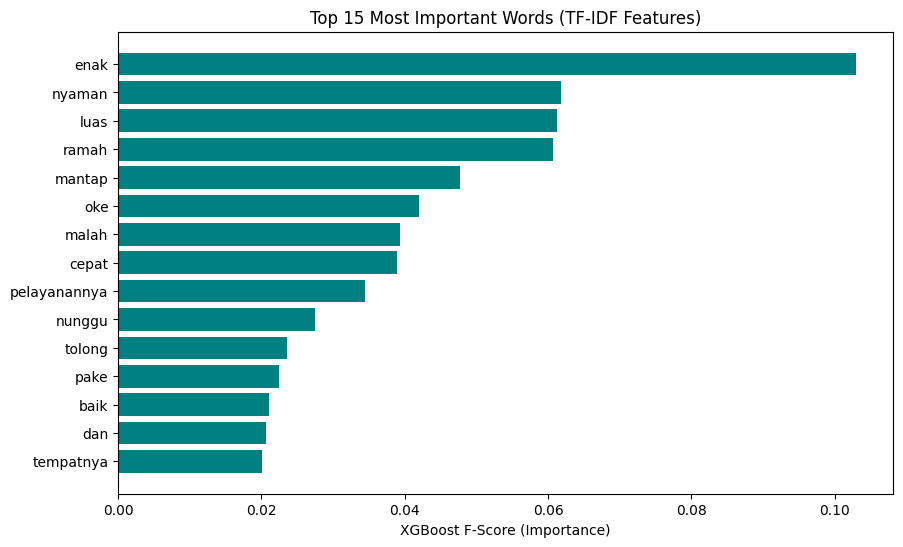
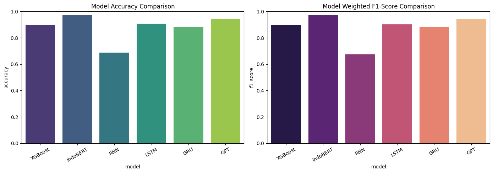

# Classify Sentiment of Google Maps Reviews

---

## Business Problem

The client wants to understand what customers are saying about their restaurant so they can identify areas for improvement and maintain aspects that customers appreciate.

---

## Objective

- Build a model that can collect Google Maps reviews and classify them into positive and negative sentiment.
- Compare several machine learning and deep learning architectures to identify the most suitable model for future use.
- Evaluate model performance using standard classification metrics.

---

## Dataset

The raw dataset was collected from Google Maps reviews of Mie Gacoan on Tuparev Street, Cirebon, West Java.

The location has more than 5,000 reviews, but only 1,000 reviews were collected for this project to reduce the data collection time. Collecting approximately 1,000 reviews took around 25 minutes due to limitations in scrolling through Google Maps reviews.

### Dataset Characteristics

- 1,000 human-written reviews.
- Contains informal language, slang, emojis, abbreviations, and other noisy text.
- Reviews were converted into two sentiment categories based on their ratings:
  - **1–2 stars → Negative**
  - **4–5 stars → Positive**
- 3-star reviews were excluded because they were considered ambiguous for binary sentiment classification.

---

## Exploratory Data Analysis (EDA)

### Key Insights

- The raw reviews contain various forms of noisy text, including slang, emojis, abbreviations, and informal expressions, requiring text cleaning before modeling.
- Google Maps review scraping requires some manual interaction and monitoring to ensure the collection process works correctly.
- Data collection speed is limited by Google Maps' review-loading and scrolling behavior, making large-scale scraping relatively time-consuming.
- TF-IDF analysis was used to identify words that contributed most strongly to the classification features.

---

## Preprocessing

- Cleaned the raw review text before feeding it into the models.
- Removed 3-star reviews to create clearer positive and negative categories.
- Converted ratings into binary sentiment labels:
  - 1–2 stars → Negative
  - 4–5 stars → Positive
- Applied text normalization and regular-expression-based cleaning to handle noisy review content.
- Used TF-IDF to represent word importance for the traditional machine learning approach.

---

## Modeling

### Architecture Used

Several traditional machine learning and deep learning approaches were compared:

- XGBoost
- RNN
- LSTM
- GRU
- IndoBERT
- GPT

The models represent different approaches, ranging from traditional machine learning and recurrent neural networks to Transformer-based language models.

---

## Evaluation Metric

The models were evaluated using:

- Accuracy
- F1 Score
- Confusion Matrix

Accuracy was used to measure overall classification correctness, while F1 Score was used to provide a more balanced view of classification performance.

---

## Model Result

The following results were obtained from the experiment:

| Model | Computational Time | Accuracy | F1 Score |
| :--- | ---: | ---: | ---: |
| XGBoost | 1.5s | 0.8958 | 0.8973 |
| IndoBERT | 2m 10s | **0.9740** | **0.9741** |
| RNN | **1.1s** | 0.6875 | 0.6736 |
| LSTM | 1.3s | 0.9063 | 0.9021 |
| GRU | 1.2s | 0.8802 | 0.8823 |
| GPT | 3m 23s | 0.9427 | 0.9433 |

## Visualize

### Top 15 Feature Importance Using TF-IDF

### Model Metric Comparison

---

## Key Findings

- **IndoBERT achieved the best predictive performance**, with 97.40% accuracy and 97.41% F1 score.
- **RNN was the fastest model** in this experiment at approximately 1.1 seconds, but its predictive performance was significantly lower than the other models.
- **LSTM provided a strong balance between speed and predictive performance**, achieving 90.63% accuracy and 90.21% F1 score.
- GPT achieved the second-highest predictive performance after IndoBERT, but required significantly more computational time in this experiment.
- All models correctly classified the two additional test samples. However, because the external test set contained only two samples, this result is not sufficient to evaluate generalization reliably.
- The experiment demonstrates a clear trade-off between computational cost and predictive performance across different architectures.

---

## Business Insight

- For restaurant review sentiment classification where predictive performance is the primary priority, **IndoBERT is the strongest candidate** based on this experiment.
- A sentiment classification system could help the restaurant identify negative reviews that require attention while also monitoring positive feedback that should be maintained.
- Reviews can potentially be analyzed continuously to identify recurring customer complaints, such as service quality, food quality, waiting time, or cleanliness.
- If computational efficiency is more important than maximum predictive performance, **LSTM provides a reasonable lightweight alternative** based on the current results.

---

## Final Decision

### Recommended Architecture: IndoBERT

### Reasons

- Achieved the highest accuracy (**97.40%**) among the tested models.
- Achieved the highest F1 score (**97.41%**).
- Performs significantly better than the traditional and recurrent neural network approaches in this experiment.
- More suitable when sentiment classification quality is the primary business requirement.

**Alternative:** LSTM can be considered when computational efficiency and a simpler architecture are more important than maximizing predictive performance.

---

## Limitations

- The dataset contains only 1,000 reviews, which is relatively small for a general-purpose NLP model.
- The dataset was collected from only one restaurant location, so the model may not generalize well to reviews from other restaurants or businesses.
- The sentiment labels were derived from star ratings rather than manually annotated sentiment. A 4–5 star review may still contain negative comments, and vice versa.
- Only 1–2 star and 4–5 star reviews were used, while neutral 3-star reviews were excluded.
- The additional test dataset contained only two reviews, making it insufficient for reliable evaluation of real-world generalization.
- Google Maps scraping speed is limited by the platform's review-loading and scrolling behavior.
- Computational time was measured within this specific experiment and hardware environment, so it should not be interpreted as a universal benchmark.

---

## Future Improvements

- Collect more reviews from multiple restaurant locations and businesses to improve dataset diversity.
- Add manually annotated sentiment labels to create a more reliable ground-truth dataset.
- Include a neutral sentiment category for 3-star reviews.
- Improve the scraping pipeline to make large-scale data collection more efficient and robust.
- Perform cross-validation and evaluate the models on a larger held-out test set.
- Experiment with additional Transformer-based models such as T5 or other Indonesian-language models.
- Build a dashboard that automatically summarizes sentiment trends and recurring customer complaints.

---

## Tech Stack

- matplotlib==3.11.1
- numpy==2.5.2
- pandas==3.0.5
- playwright==1.62.0
- scikit-learn==1.9.0
- seaborn==0.13.2
- torch==2.6.0+cu124
- transformers==5.15.1
- xgboost==3.4.1

---

## What I Learned (1% Improvement)

- Learned how to collect Google Maps reviews using Playwright.
- Learned how to clean noisy text using regular expressions.
- Learned how to use TF-IDF to identify important words and transform text into machine-learning features.
- Learned how different architectures trade off computational efficiency and predictive performance.
- Learned that confidence in model performance should be supported by a sufficiently large and representative evaluation dataset.