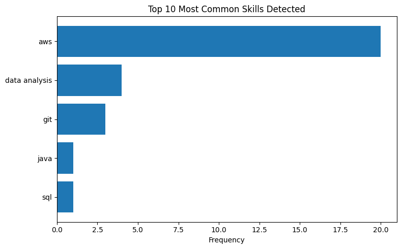

# Resume Information Extraction with Named Entity Recognition (NER)

---

## Business Problem

The client wants to create a system to reduce resume screening time.

---

## Objective

- Automatically screen resumes.

---

## Dataset

Dataset I took from Kaggle.

### Dataset Characteristics

- 2,484 instances and 4 columns.
- Without missing values.
- Without a person's name feature (anonymous).

---

## Exploratory Data Analysis (EDA)

### Key Insights

- Since the dataset does not have a person's name, I created a unique ID.
- Filter skills based on what we want to find, in this case, technology skills.

---

## Preprocessing

- Using regex to remove whitespace, symbols, and other unnecessary characters.
- Creating a keyword list for the skills we want to find.
- Since the dataset is anonymous, I created a unique ID to distinguish each candidate.
- Each resume is truncated to the first 5,000 characters before processing, to keep runtime efficient.

---

## Modeling

### Architecture Used

spaCy's pretrained `en_core_web_sm` model, used as-is without fine-tuning, to extract `ORG`, `GPE`/`LOC`, and `DATE` entities. Skills are **not** extracted via NER — they're identified through simple keyword matching against a fixed list of ~20 technology terms (e.g., python, sql, aws, docker, git). NER handles organizations, locations, and dates; keyword matching handles skills.

### Scope

This was run on a sample of 50 resumes out of the 2,484 available, not the full dataset.

---

## Evaluation Metric

No evaluation metric was used in this case. The output was evaluated based on the extracted entities and filtered skills from the sample.

## Model Result

| person_id | Category | organizations | locations | dates | skills |
| :--- | :--- | :--- | :--- | :--- | :--- |
| Candidate_16852973 | HR | Team management Marketing savvy Conflict, DOT,... | Hospitality, Training, Client, Missouri, － City | 15+ years, Dec 2013, 2 months, 2012, daily | aws, data analysis |
| Candidate_22323967 | HR | Communications, Marketing, Human Resources and... | US, － City, Connecticut | monthly, quarterly, annual, daily, 2013 | git |
| Candidate_33176873 | HR | Human Resources Executive Management, HRIS, He... | Kansas, Memberships | 20 years, 15 plus years, 5 years, 4 years, 1999 | |
| Candidate_27018550 | HR | Driven, Skills Type, Microsoft, Access, Outloo... | － City, San Antonio | 20 years, 50, May 2007, 2007, 2003 | |
| Candidate_17812897 | HR | Compensation Administration Orientation & On-B... | Paychex, VSTD, － City | Jan 2015, my first month, Jan 2013 to Jan 2015... | aws |
| Candidate_11592605 | HR | Highlights Microsoft Office, Time, 08/2014 HR ... | － City, H-1B, U.S. | monthly, daily, 2012, 2000, 2008 | |
| Candidate_25824789 | HR | State, Highlights University Events/Special Pr... | Houston, Sharepoint, Company Name City, Name City | 1999 | |
| Candidate_15375009 | HR | Project, 06/2016, Current Company Name, 05/201... | year-end Work History HR, 9 months, over-year-... | | aws |
| Candidate_11847784 | HR | FLSA, ADA, Skills Management consultation, Micr... | － City | 15+ years, Eight years, 250+, 10-month, daily | aws |
| Candidate_32896934 | HR | Highlights New Employee Orientation Applicant ... | Lean, － City | 01/2010, daily, monthly, 2015 | aws |

Each `organizations`/`locations` cell shows at most 5 unique entities, in order of first appearance in the text — this is why longer entries are cut off with "...". Some entries are noisy (e.g., "－ City", "H-1B", "Paychex" tagged as a location) — an expected result of using a small, general-purpose NER model on domain-specific resume text without fine-tuning.

---

## Key Findings

- The system can extract and filter resumes based on the skills we are looking for, though only tested on a 50-resume sample.
- AWS appears frequently among the extracted skills in this sample.
- Entity extraction quality varies — organizations and locations contain some noisy or irrelevant fragments, consistent with using `en_core_web_sm` without domain adaptation.

---

## Business Insight

- On the sample tested, the system can extract relevant information from resumes automatically.
- This suggests it could help reduce time in the initial HR recruitment screening process, though it needs to be validated on the full dataset and against manually reviewed results before being relied on for actual screening.

---

## Final Decision

### Recommended Architecture: spaCy

### Reasons

- Suitable for NER tasks.
- Suitable for efficient entity extraction.

---

## Limitations

- The dataset is already provided in CSV or tabular format rather than raw resume files.
- No evaluation metric was used to measure the quality of the extracted entities.
- The model was not compared with other NER approaches or spaCy model sizes (e.g., `en_core_web_lg` or a transformer-based model).
- Only tested on a sample of 50 resumes, not the full 2,484-row dataset.
- Skills are identified through keyword matching, not NER — this only catches skills in the predefined list and will miss anything not on it (e.g., unlisted tools, soft skills, or spelling variants).
- Resumes are truncated to 5,000 characters, so entities later in longer resumes are never seen by the model.

---

## Future Improvements

- Run on the full dataset rather than a 50-resume sample.
- Try extracting information directly from individual resume files.
- Classify job categories based on extracted skills.
- Evaluate the NER results using manually labeled data.
- Compare different NER models (e.g., `en_core_web_lg`, `en_core_web_trf`) and larger skill keyword lists or a trained skill-matcher.
- Remove the character truncation, or chunk long resumes so no content is skipped.

---

## Tech Stack

- matplotlib==3.11.1
- pandas==3.0.5
- spacy==3.8.16

---

## What I Learned (1% Improvement)

- Learned how spaCy works.
- Learned how to extract information using NER.
- Learned how NLP can be applied to automate resume screening.
- Learned that off-the-shelf, small NER models need domain adaptation to perform well on specialized text like resumes.